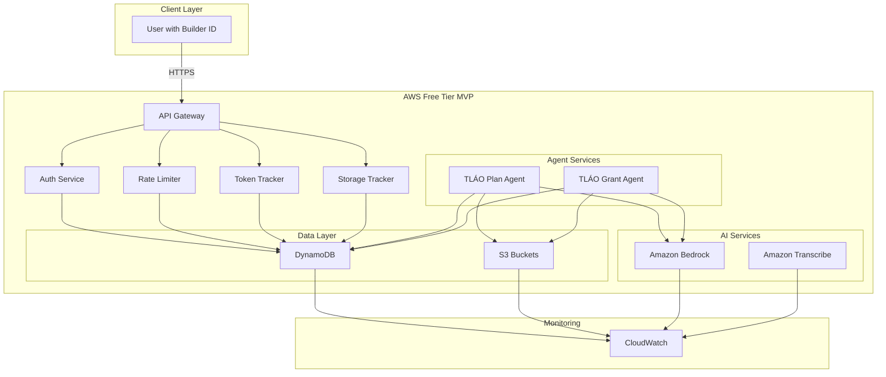

# Design Document: TLÁO Autonomous Agent Platform

## Overview

TLÁO is an autonomous agent platform providing two specialized AI agents (TLÁO Plan and TLÁO Grant) built on AWS Free Tier constraints. The platform follows a hybrid SaaS + BYOA model with a multi-tenant SaaS MVP in founders' AWS account and self-hosted deployment for Phase 2.

### Key Constraints
- Demo-ready deployment in under 5 minutes
- AWS Free Tier compliant (application-level limits)
- No root credentials required
- Builder ID for community identity only

**Note**: This spec supersedes the deprecated ai-agent-platform spec. The old spec (Ops Copilot/Grant Navigator) has been replaced with TLÁO Plan/TLÁO Grant agents with enhanced Free Tier enforcement and BYOA support.

## Architecture



### High-Level System Design

```
┌─────────────────────────────────────────────────────────────────┐
│                        Client Layer                              │
│  (Web UI, Mobile App, CLI, Third-party Integrations)            │
└────────────────────────┬────────────────────────────────────────┘
                         │
                         ▼
┌─────────────────────────────────────────────────────────────────┐
│                    API Gateway (REST)                            │
│  - Authentication (Builder ID / AWS IAM)                        │
│  - Request validation                                            │
│  - Response formatting                                           │
└────────────────────────┬────────────────────────────────────────┘
                         │
        ┌────────────────┼────────────────┐
        ▼                ▼                ▼
┌──────────────┐  ┌──────────────┐  ┌──────────────┐
│   Document   │  │    Agent     │  │   History    │
│  Ingestion   │  │ Orchestrator │  │  Retrieval   │
│   Lambda     │  │   Lambda     │  │   Lambda     │
└──────┬───────┘  └──────┬───────┘  └──────┬───────┘
       │                 │                 │
       ▼                 ▼                 ▼
┌─────────────────────────────────────────────────────────────────┐
│                    Shared Services Layer                         │
│  ┌──────────────┐  ┌──────────────┐  ┌──────────────┐          │
│  │   Bedrock    │  │  Transcribe  │  │  CloudWatch  │          │
│  │  (Claude)    │  │  (Audio→Text)│  │  (Logging)   │          │
│  └──────────────┘  └──────────────┘  └──────────────┘          │
└─────────────────────────────────────────────────────────────────┘
       │                 │                 │
       ▼                 ▼                 ▼
┌─────────────────────────────────────────────────────────────────┐
│                    Data Layer                                    │
│  ┌──────────────┐  ┌──────────────┐  ┌──────────────┐          │
│  │  DynamoDB    │  │      S3      │  │     KMS      │          │
│  │  (State)     │  │  (Documents) │  │ (Encryption) │          │
│  └──────────────┘  └──────────────┘  └──────────────┘          │
└─────────────────────────────────────────────────────────────────┘
```

### Request Flow

1. **Client** sends request to API Gateway with document or agent invocation
2. **API Gateway** validates authentication and routes to appropriate Lambda
3. **Document Ingestion Lambda** (if applicable):
   - Validates file format and size
   - Transcribes audio using Transcribe
   - Extracts text and stores in S3
   - Records metadata in DynamoDB
4. **Agent Orchestrator Lambda**:
   - Retrieves user context and previous documents from DynamoDB
   - Constructs prompt for Bedrock
   - Invokes Bedrock with appropriate model
   - Parses and validates response
   - Stores results in DynamoDB
5. **Response** returned to client with structured output

## Components and Interfaces

### 1. API Gateway

**Responsibility**: HTTP request routing, authentication, response formatting

**Endpoints**:
- `POST /documents/upload` - Upload document for processing
- `POST /agents/{agentType}/invoke` - Invoke an agent (tlao-plan, tlao-grant)
- `GET /history/{userId}` - Retrieve execution history
- `GET /results/{resultId}` - Retrieve specific result
- `GET /health` - Health check

**Authentication**: Builder ID (header: `X-Builder-ID`) or AWS SigV4

**Response Format**:
```json
{
  "success": true,
  "data": { /* agent-specific output */ },
  "metadata": {
    "requestId": "uuid",
    "timestamp": "ISO-8601",
    "processingTimeMs": 1234
  }
}
```

### 2. Document Ingestion Lambda

**Responsibility**: Accept, validate, and process documents in multiple formats

**Inputs**:
- File (multipart/form-data)
- User ID
- Document type (email, pdf, audio, text, markdown)

**Processing**:
1. Validate file size (max 50MB)
2. Validate MIME type
3. Extract text:
   - Email: Parse headers and body
   - PDF: Extract text using textract or similar
   - Audio: Transcribe using Amazon Transcribe
   - Text/Markdown: Direct ingestion
4. Store raw file in S3 with path: `s3://bucket/documents/{userId}/{documentId}/{filename}`
5. Store metadata in DynamoDB:
   - documentId (UUID)
   - userId
   - uploadTime
   - documentType
   - textContent (first 5000 chars for indexing)
   - s3Path
   - transcriptPath (if audio)

**Outputs**:
```json
{
  "documentId": "uuid",
  "status": "processed",
  "textLength": 5000,
  "s3Path": "s3://bucket/documents/..."
}
```

### 3. Agent Orchestrator Lambda

**Responsibility**: Coordinate agent execution, Bedrock invocation, and result storage

**Inputs**:
- agentType (tlao-plan, tlao-grant)
- userId
- documentIds (array of document IDs to process)
- agentConfig (optional parameters)

**Processing**:
1. Retrieve user profile from DynamoDB
2. Retrieve documents from S3 and DynamoDB
3. Construct agent-specific prompt
4. Invoke Bedrock with:
   - Model: Claude 3 Sonnet (or Titan for cost optimization)
   - Max tokens: 2000
   - Temperature: 0.7
5. Parse response JSON
6. Validate response schema
7. Store result in DynamoDB:
   - resultId (UUID)
   - userId
   - agentType
   - inputDocumentIds
   - output (structured JSON)
   - createdAt
   - tokensUsed
8. Return result to client

**Outputs** (agent-specific):
- TLÁO Plan: `{ executionPlan: [...], alerts: [...], metrics: {...} }`
- TLÁO Grant: `{ grants: [...], proposals: [...] }`

### 4. Agent Implementations

#### TLÁO Plan Agent

**Prompt Template**:
```
You are an AI operations assistant for solo founders. Analyze the following operational inputs and generate a structured execution plan.

Inputs:
{documents}

Generate a JSON response with:
{
  "executionPlan": [
    {
      "taskId": "string",
      "title": "string",
      "priority": "high|medium|low",
      "owner": "string",
      "deadline": "YYYY-MM-DD",
      "estimatedHours": number,
      "dependencies": ["taskId"]
    }
  ],
  "alerts": [
    {
      "severity": "critical|warning|info",
      "message": "string",
      "affectedTasks": ["taskId"]
    }
  ],
  "metrics": {
    "totalTasks": number,
    "highPriorityCount": number,
    "blockedCount": number,
    "estimatedWeeklyHours": number
  }
}
```

**Validation**:
- All tasks have unique taskIds
- Deadlines are within 7 days
- Priority values are valid
- Dependencies reference existing tasks

#### TLÁO Grant Agent

**Prompt Template**:
```
You are an AI grant discovery and proposal assistant. Analyze the organization profile and generate grant matches and proposal drafts.

Organization Profile:
{organizationData}

Available Grants Database:
{grantsDatabase}

Generate a JSON response with:
{
  "grants": [
    {
      "grantId": "string",
      "name": "string",
      "funder": "string",
      "amount": number,
      "deadline": "YYYY-MM-DD",
      "eligibilityScore": 0-100,
      "matchReasons": ["string"],
      "url": "string"
    }
  ],
  "proposals": [
    {
      "grantId": "string",
      "executiveSummary": "string",
      "problemStatement": "string",
      "solution": "string",
      "budget": { /* budget breakdown */ },
      "impactMetrics": ["string"]
    }
  ]
}
```

**Validation**:
- Eligibility scores are 0-100
- All proposals reference valid grants
- Budget totals are reasonable
- URLs are valid

### 5. History Retrieval Lambda

**Responsibility**: Query and return user execution history

**Inputs**:
- userId
- agentType (optional filter)
- limit (default 20, max 100)
- offset (for pagination)

**Processing**:
1. Query DynamoDB for results matching userId and optional agentType
2. Sort by createdAt descending
3. Apply pagination
4. Return results with metadata

**Outputs**:
```json
{
  "results": [
    {
      "resultId": "uuid",
      "agentType": "tlao-plan",
      "createdAt": "ISO-8601",
      "summary": "string",
      "tokensUsed": number
    }
  ],
  "pagination": {
    "total": number,
    "limit": number,
    "offset": number
  }
}
```

### Data Layer
- **DynamoDB**: User sessions, metadata, usage tracking, execution plans, grant matches
- **S3**: Document storage with encryption at rest

### AI Services
- **Amazon Bedrock**: AI reasoning for plan generation and grant matching

## Data Models

### DynamoDB Tables

#### 1. Users Table
```
PK: userId (String)
SK: (none)

Attributes:
- userId: String (UUID)
- email: String
- organizationType: String (founder, ngo, startup)
- createdAt: Number (Unix timestamp)
- lastActiveAt: Number
- preferences: Map
  - language: String (en, es, pt)
  - timezone: String
  - notificationEmail: String
```

#### 2. Documents Table
```
PK: userId (String)
SK: documentId (String)

Attributes:
- userId: String
- documentId: String (UUID)
- uploadTime: Number (Unix timestamp)
- documentType: String (email, pdf, audio, text, markdown)
- fileName: String
- fileSize: Number (bytes)
- s3Path: String
- transcriptPath: String (if audio)
- textContent: String (first 5000 chars)
- metadata: Map
  - source: String (email, upload, etc.)
  - sender: String (if email)
  - subject: String (if email)
```

#### 3. Results Table
```
PK: userId (String)
SK: resultId (String)

Attributes:
- userId: String
- resultId: String (UUID)
- agentType: String (tlao-plan, tlao-grant)
- createdAt: Number (Unix timestamp)
- inputDocumentIds: List<String>
- output: Map (agent-specific structured output)
- tokensUsed: Number
- processingTimeMs: Number
- status: String (success, error)
- errorMessage: String (if status=error)
```

#### 4. Sessions Table
```
PK: sessionId (String)
SK: (none)

Attributes:
- sessionId: String (UUID)
- userId: String
- apiKey: String (hashed)
- createdAt: Number
- expiresAt: Number
- lastUsedAt: Number
- ipAddress: String
```

### S3 Bucket Structure
```
s3://tlao-platform-{accountId}/
├── documents/
│   ├── {userId}/
│   │   ├── {documentId}/
│   │   │   ├── original.{ext}
│   │   │   ├── transcript.txt (if audio)
│   │   │   └── metadata.json
├── results/
│   ├── {userId}/
│   │   ├── {resultId}.json
├── logs/
│   ├── {date}/
│   │   ├── {timestamp}-{requestId}.log
```

### User Session
```json
{
  "userId": "string",
  "sessionId": "string",
  "builderId": "string",
  "createdAt": "timestamp",
  "expiresAt": "timestamp",
  "permissions": ["string"]
}
```

### Execution Plan
```json
{
  "planId": "string",
  "userId": "string",
  "inputFileKey": "string",
  "planFormat": "json|markdown|yaml",
  "planContent": "object|string",
  "generatedAt": "timestamp",
  "metadata": {
    "inputType": "email|note|transcript",
    "processingTime": "integer",
    "tokensUsed": "integer"
  }
}
```

### Organization Profile
```json
{
  "orgId": "string",
  "userId": "string",
  "orgName": "string",
  "description": "string",
  "industry": "string",
  "size": "string",
  "location": "string",
  "fundingStage": "string",
  "createdAt": "timestamp",
  "updatedAt": "timestamp"
}
```

### Grant Match
```json
{
  "matchId": "string",
  "orgId": "string",
  "grantId": "string",
  "relevanceScore": "float",
  "matchingCriteria": ["string"],
  "proposalDraft": "string",
  "createdAt": "timestamp"
}
```

### Usage Tracking
```json
{
  "userId": "string",
  "date": "string",
  "tokenUsage": "integer",
  "storageUsage": "integer",
  "requestCount": "integer",
  "lastUpdated": "timestamp"
}
```

## Correctness Properties

A property is a characteristic or behavior that should hold true across all valid executions of a system-essentially, a formal statement about what the system should do. Properties serve as the bridge between human-readable specifications and machine-verifiable correctness guarantees.

### Property-Based Testing Overview

Property-based testing (PBT) validates software correctness by testing universal properties across many generated inputs.
Each property is a formal specification that should hold for all valid inputs.

#### Core Principles

1. **Universal Quantification**: Every property must contain an explicit "for all" statement
2. **Requirements Traceability**: Each property must reference the requirements it validates
3. **Executable Specifications**: Properties must be implementable as automated tests
4. **Comprehensive Coverage**: Properties should cover all testable acceptance criteria

#### Common Property Patterns

1. **Invariants**: Properties preserved after transformation
2. **Round Trip Properties**: Combining operations with inverses
3. **Idempotence**: Operations where doing twice = doing once
4. **Metamorphic Properties**: Relationships between components
5. **Model Based Testing**: Optimized vs standard implementations
6. **Confluence**: Order independence
7. **Error Conditions**: Bad input handling

### Property Creation Process

1. **Prework Analysis**: Analyze each acceptance criterion
2. **Testability Assessment**: Determine if criterion is testable as property, example, or edge case
3. **Property Formulation**: Convert testable criteria into universally quantified properties
4. **Requirements Mapping**: Annotate each property with requirements it validates

### Property Reflection

After completing the initial prework analysis, the model MUST perform a property reflection to eliminate redundancy:

**Property Reflection Steps:**
1. Review ALL properties identified as testable in the prework
2. Identify logically redundant properties where one property implies another
3. Identify properties that can be combined into a single, more comprehensive property
4. Mark redundant properties for removal or consolidation
5. Ensure each remaining property provides unique validation value

### Property 1: Document Ingestion Round Trip

**For any** valid document uploaded to the system, retrieving the document from S3 and comparing its text content to the original should produce equivalent text (allowing for minor formatting differences).

**Validates: Requirements 12.1, 12.2, 12.3**

**Rationale**: Ensures that documents are correctly stored and retrievable without data loss or corruption.

### Property 2: Execution Plan Consistency

**For any** set of operational inputs processed by TLÁO Plan, the generated execution plan should have all tasks with valid priorities, all deadlines within 7 days, and no circular dependencies.

**Validates: Requirements 2.1, 2.2, 2.3**

**Rationale**: Ensures the agent produces structurally valid execution plans that can be reliably used by founders.

### Property 3: Grant Eligibility Monotonicity

**For any** grant in the TLÁO Grant results, if an organization meets a grant's eligibility criteria, the eligibility score should be greater than 0, and if it doesn't meet criteria, the score should be 0.

**Validates: Requirements 3.1, 3.2**

**Rationale**: Ensures eligibility scoring is logically consistent with stated criteria.

### Property 4: Data Persistence Round Trip

**For any** result stored in DynamoDB, retrieving it by resultId should return the exact same data (including all nested structures and metadata).

**Validates: Requirements 7.1, 7.2, 7.3**

**Rationale**: Ensures data integrity and that users can reliably retrieve their work.

### Property 5: API Response Schema Validity

**For any** successful API response, the response should conform to the documented JSON schema with required fields present and correct types.

**Validates: Requirements 13.1, 13.3**

**Rationale**: Ensures API clients can reliably parse responses without unexpected field variations.

### Property 6: Authentication Enforcement

**For any** API request without valid authentication credentials, the system should reject the request with a 401 or 403 status code and not process the request.

**Validates: Requirements 13.2, 15.1, 15.2**

**Rationale**: Ensures unauthorized access is prevented and user data is protected.

### Property 7: Error Handling Graceful Degradation

**For any** invalid input provided to the system, the system should return a descriptive error message and maintain consistent state (no partial updates or corrupted data).

**Validates: Requirements 14.1, 14.4**

**Rationale**: Ensures the system is resilient and users understand what went wrong.

### Property 8: Multilingual Support Consistency

**For any** request to TLÁO Grant in a supported language (English, Spanish, Portuguese), the response should be in the requested language and maintain semantic equivalence.

**Validates: Requirements 4.4**

**Rationale**: Ensures the system reliably serves multilingual users without language mixing or loss of meaning.

### Correctness Properties

Property 1: Multi-tenancy data isolation
*For any* two users in the system, when each user creates execution plans and uploads documents, the data created by one user should never be accessible by the other user
**Validates: Requirements 1.2**

Property 2: Free tier limit enforcement
*For any* user in the system, when their daily token usage or storage usage exceeds their allocated limit, subsequent requests should be rejected with appropriate HTTP status codes (429 for rate limits, 413 for storage limits)
**Validates: Requirements 1.3, 4.1, 4.2, 4.3, 4.4**

Property 3: Rate limiting consistency
*For any* user making API requests, when they exceed the rate limit of 100 requests per minute, subsequent requests should be rejected with a 429 status and a retry-after header
**Validates: Requirements 1.4, 4.5, 4.6**

Property 4: Plan generation format consistency
*For any* valid operational input file and any requested format (JSON, Markdown, YAML), when the TLÁO Plan Agent processes the file, the output should be valid and parseable in the requested format
**Validates: Requirements 2.3**

Property 5: Plan generation content completeness
*For any* operational input file, when the TLÁO Plan Agent generates an execution plan, the plan should contain all actionable items identified in the input
**Validates: Requirements 2.1, 2.2**

Property 6: File size validation
*For any* file upload exceeding the maximum allowed size, the system should reject the upload with a 413 status and return an error message with the acceptable file size range
**Validates: Requirements 2.4**

Property 7: Grant matching relevance ordering
*For any* organization profile and set of available grants, when the TLÁO Grant Agent returns matches, they should be ordered by relevance score in descending order
**Validates: Requirements 3.2**

Property 8: Proposal draft content accuracy
*For any* organization profile with matched grants, when a proposal draft is generated, it should contain information relevant to the matched grants
**Validates: Requirements 3.3**

Property 9: No-match handling
*For any* organization profile with no matching grants, the system should return a message indicating no matches were found
**Validates: Requirements 3.4**

Property 10: Session token validity
*For any* authenticated user, when they make subsequent requests with a valid session token, the system should accept the request; when they make requests with an invalid or expired token, the system should reject with a 401 status
**Validates: Requirements 6.2, 6.3, 6.4**

Property 11: Execution plan persistence
*For any* execution plan created by a user, when the plan is stored in DynamoDB with metadata, it should be retrievable by the same user with all metadata intact
**Validates: Requirements 7.1**

Property 12: Document encryption
*For any* document uploaded to S3, when stored, it should be encrypted at rest using AES-256 encryption
**Validates: Requirements 7.2, 7.3**

Property 13: Data portability
*For any* user requesting their data, when they make a request, the system should return their data in a portable format (JSON, CSV)
**Validates: Requirements 7.4**

Property 14: Logging completeness
*For any* API request processed by the system, when the request is completed, the system should log request metadata to CloudWatch including timestamp, user ID, endpoint, and response status
**Validates: Requirements 8.1**

Property 15: Error logging context
*For any* error occurring in the system, when the error is logged, it should include sufficient context (stack trace, request ID, user ID) to diagnose the issue
**Validates: Requirements 8.2**

Property 16: Usage tracking accuracy
*For any* user making API requests or storing data, when usage is tracked, the token usage, storage usage, and request count should be accurate within 1% of actual usage
**Validates: Requirements 8.3**

Property 17: Alarm threshold triggering
*For any* usage metric approaching 80% of its limit, when the threshold is crossed, the system should emit a CloudWatch alarm
**Validates: Requirements 8.4**

Property 18: Demo deployment time
*For any* demo deployment execution, when the deployment script runs, it should complete within 5 minutes
**Validates: Requirements 9.1**

Property 19: Demo URL generation
*For any* completed demo deployment, when the deployment finishes, the system should provide a valid demo URL
**Validates: Requirements 9.2**

Property 20: Latency requirements
*For any* API endpoint, when a request is made, 95% of responses should be returned within 2 seconds
**Validates: Requirements 10.1**

Property 21: AI processing time
*For any* standard input to the AI agents, the processing should complete within 30 seconds
**Validates: Requirements 10.2**

Property 22: Availability requirements
*For any* business hour period, the system should maintain 99.5% availability
**Validates: Requirements 10.3**

Property 23: Security patch deployment
*For any* discovered security vulnerability, when a patch is available, it should be deployed within 72 hours
**Validates: Requirements 10.4**

Property 24: GDPR data deletion
*For any* user requesting data deletion, when the request is made, the system should delete all user data within 24 hours
**Validates: Requirements 10.5**

## Error Handling

### Error Categories and Responses

#### 1. Authentication Errors (401, 403)
- Missing API key: `{ "error": "Missing authentication credentials", "code": "AUTH_MISSING" }`
- Invalid API key: `{ "error": "Invalid API key", "code": "AUTH_INVALID" }`
- Expired session: `{ "error": "Session expired", "code": "AUTH_EXPIRED" }`

#### 2. Validation Errors (400)
- Invalid file format: `{ "error": "File format not supported: .docx", "code": "INVALID_FORMAT" }`
- File too large: `{ "error": "File exceeds 50MB limit", "code": "FILE_TOO_LARGE" }`
- Missing required field: `{ "error": "Missing required field: agentType", "code": "MISSING_FIELD" }`

#### 3. Resource Errors (404)
- Document not found: `{ "error": "Document not found", "code": "NOT_FOUND" }`
- Result not found: `{ "error": "Result not found", "code": "NOT_FOUND" }`

#### 4. Rate Limit Errors (429)
- Too many requests: `{ "error": "Rate limit exceeded. Retry after 60 seconds", "code": "RATE_LIMIT" }`

#### 5. Server Errors (500)
- Bedrock API failure: `{ "error": "AI service temporarily unavailable. Please retry.", "code": "SERVICE_ERROR" }`
- Database error: `{ "error": "Database error. Please retry.", "code": "DB_ERROR" }`

### Retry Strategy
- Client-side: Exponential backoff (1s, 2s, 4s, 8s) for 429 and 5xx errors
- Server-side: Lambda retries Bedrock calls up to 3 times with exponential backoff

## Testing Strategy

### Unit Testing

Unit tests verify specific examples, edge cases, and error conditions:

1. **Document Ingestion Tests**:
   - Valid file upload (PDF, email, audio, text)
   - Invalid file format rejection
   - File size validation
   - Text extraction accuracy

2. **Agent Logic Tests**:
   - Execution plan generation with sample inputs
   - Grant eligibility scoring with known data
   - Error handling for malformed Bedrock responses

3. **Data Model Tests**:
   - DynamoDB item creation and retrieval
   - S3 document storage and retrieval
   - Data validation (required fields, types)

4. **API Tests**:
   - Authentication validation
   - Request/response schema validation
   - Error response formatting
   - Pagination logic

### Property-Based Testing

Property-based tests verify universal properties across many generated inputs:

1. **Property 1: Document Ingestion Round Trip**
   - Generate random documents in supported formats
   - Upload and retrieve
   - Verify text content equivalence

2. **Property 2: Execution Plan Consistency**
   - Generate random operational inputs
   - Invoke TLÁO Plan agent
   - Verify plan structure validity

3. **Property 3: Grant Eligibility Monotonicity**
   - Generate random organization profiles
   - Invoke TLÁO Grant agent
   - Verify eligibility scores match criteria

4. **Property 4: Data Persistence Round Trip**
   - Generate random results
   - Store in DynamoDB
   - Retrieve and verify equivalence

5. **Property 5: API Response Schema Validity**
   - Generate random valid requests
   - Invoke API endpoints
   - Verify response schema compliance

6. **Property 6: Authentication Enforcement**
   - Generate requests with missing/invalid credentials
   - Verify rejection with correct status codes

7. **Property 7: Error Handling Graceful Degradation**
   - Generate invalid inputs
   - Verify error messages and state consistency

8. **Property 8: Multilingual Support Consistency**
   - Generate requests in multiple languages
   - Verify response language and semantic equivalence

### Test Configuration

- **Minimum iterations**: 100 per property test
- **Test framework**: Jest (for Node.js/TypeScript)
- **Property testing library**: fast-check
- **Coverage target**: 80% for core logic, 60% overall

### Testing Approach

- **Unit tests** focus on specific examples and edge cases
- **Property tests** focus on universal properties and comprehensive input coverage
- Both are complementary and necessary for comprehensive coverage
- Property tests catch subtle bugs that unit tests might miss
- Unit tests provide fast feedback during development

## Cost Guardrails

### Application-Level Limits
- **Token limit**: 100,000 tokens per user per day
- **Storage cap**: 5GB per user
- **Rate limit**: 100 requests per minute per user
- **Daily cap**: 1,000 API requests per user per day

### Monitoring
- CloudWatch alarms at 80% of limits
- Daily usage reports to administrators
- Cost alerts for unexpected usage spikes

## Implementation Notes

### AWS Free Tier Considerations

1. **Bedrock**: Monitor token usage; Claude 3 Sonnet is cost-effective
2. **Lambda**: 1M free invocations/month; optimize cold start time
3. **DynamoDB**: 25GB free storage; use on-demand billing for variable load
4. **S3**: 5GB free storage; implement document retention policies
5. **Transcribe**: ~$0.0001 per second; cache transcripts to avoid re-processing

### Cost Optimization Strategies

1. Use Lambda layers for shared dependencies
2. Implement document caching to avoid re-processing
3. Batch Bedrock calls where possible
4. Use DynamoDB TTL for automatic cleanup of old results
5. Monitor CloudWatch metrics to stay within Free Tier

### Security Best Practices

1. Store API keys in AWS Secrets Manager
2. Use IAM roles for Lambda execution
3. Enable S3 bucket encryption with KMS
4. Enable VPC endpoints for private connectivity
5. Implement request signing for API calls

## Deployment Architecture

### Infrastructure as Code (Terraform/CloudFormation)

- API Gateway with REST API
- Lambda functions (Document Ingestion, Agent Orchestrator, History Retrieval)
- DynamoDB tables with appropriate indexes
- S3 bucket with lifecycle policies
- IAM roles and policies
- CloudWatch log groups
- KMS keys for encryption

### CI/CD Pipeline

- GitHub Actions for automated testing
- Automated deployment to AWS on merge to main
- Staging environment for testing
- Production environment for live traffic

## Future Enhancements

1. **Additional Agents**: Email summarization, code review assistant, etc.
2. **Webhooks**: Real-time notifications for completed tasks
3. **Integrations**: Slack, Notion, Jira, GitHub API
4. **Advanced Analytics**: Dashboard for tracking productivity trends
5. **Fine-tuning**: Custom models trained on user data for better results
