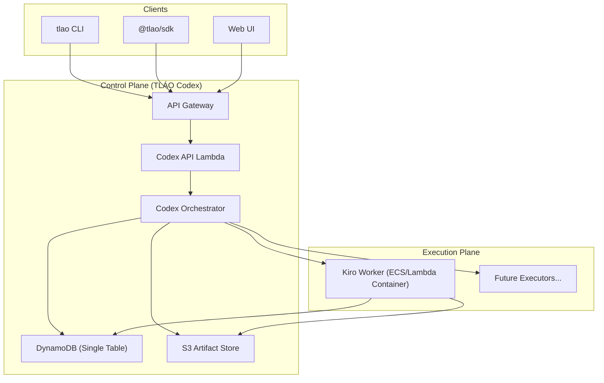
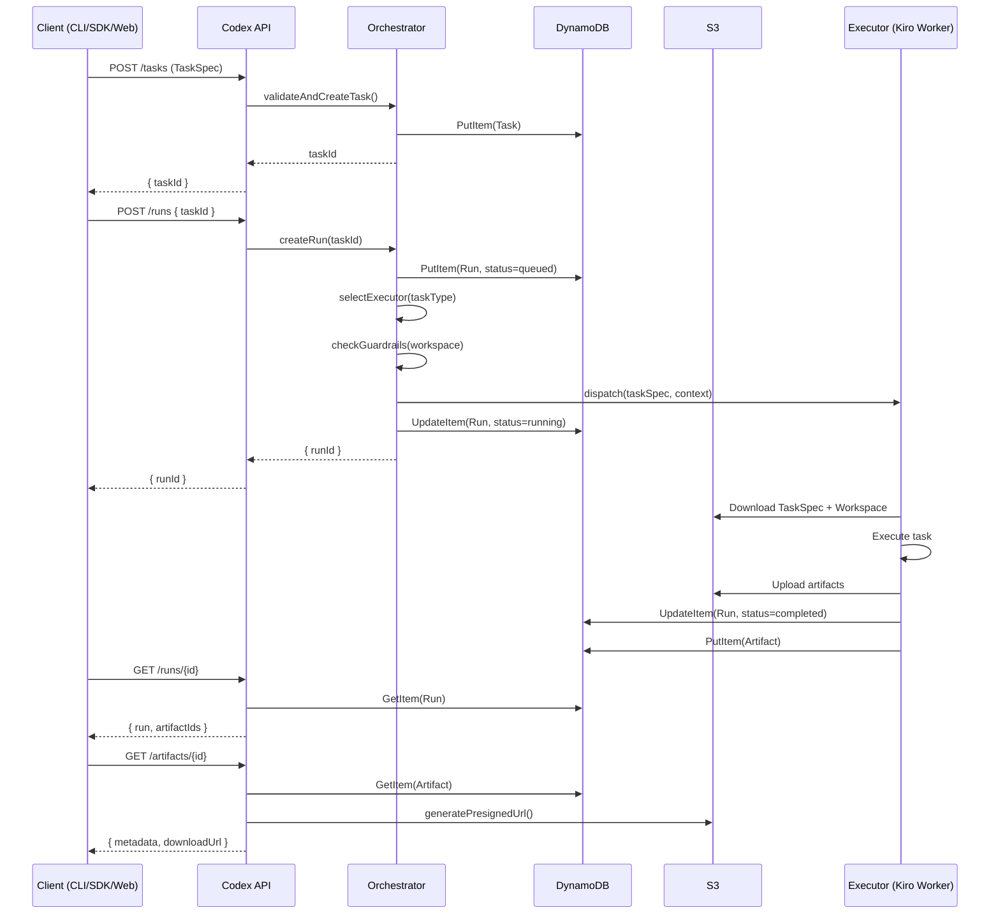

# Design Document: TLÁO Codex

## Overview

TLÁO Codex is the agent orchestration control plane that abstracts Kiro (and future AI agents) behind a unified execution system. It introduces a Task → Run → Artifact object model, a pluggable executor registry, and a DynamoDB single-table design — all within AWS Free Tier constraints.

The system is built as new packages within the existing Turborepo monorepo (`pnpm` workspaces), using TypeScript throughout. It reuses established patterns from `packages/backend` (AWS SDK v3, DynamoDB document client, S3 with pre-signed URLs, structured error classes, singleton services) while introducing new packages for the Codex API, orchestrator, CLI, SDK, and web UI.

### Key Design Decisions

1. **Single DynamoDB Table**: All entities (Workspace, Task, Run, Artifact, Executor) share one table with composite PK/SK keys. This minimizes table count for Free Tier and enables efficient workspace-scoped queries.
2. **Executor as Interface**: Executors implement a common `Executor` interface. The Kiro Worker is the first implementation; new executors are added via registry entries without code changes.
3. **Lambda + API Gateway**: The Codex API runs as Lambda handlers behind API Gateway, consistent with the existing backend pattern.
4. **Container-based Workers**: The Kiro Worker runs as an ECS Fargate task (or Lambda container) that processes one job and exits.
5. **SSE for Streaming**: Run logs stream via Server-Sent Events through API Gateway, with sequence numbers for reconnection.
6. **Monorepo Packages**: New packages are added under the existing workspace structure.

## Architecture



### Request Flow



## Components and Interfaces

### Package Structure

```
tlao/
├── packages/
│   ├── codex-api/          # API Gateway Lambda handlers
│   │   ├── src/
│   │   │   ├── handlers/   # Route handlers (tasks, runs, artifacts, auth, stream)
│   │   │   ├── middleware/  # Auth, validation, error handling
│   │   │   └── index.ts
│   │   └── package.json
│   ├── codex-core/          # Shared types, models, DynamoDB access, S3 access
│   │   ├── src/
│   │   │   ├── models/     # Entity types and validation
│   │   │   ├── services/   # DynamoDB, S3, guardrails
│   │   │   ├── executor/   # Executor interface and registry
│   │   │   └── index.ts
│   │   └── package.json
│   ├── codex-orchestrator/  # Run lifecycle, executor dispatch, policy enforcement
│   │   ├── src/
│   │   │   ├── orchestrator.ts
│   │   │   ├── dispatcher.ts
│   │   │   └── index.ts
│   │   └── package.json
│   ├── kiro-worker/         # Kiro CLI executor container
│   │   ├── src/
│   │   │   ├── worker.ts
│   │   │   └── index.ts
│   │   ├── Dockerfile
│   │   └── package.json
│   ├── tlao-cli/            # CLI tool
│   │   ├── src/
│   │   │   ├── commands/   # run, runs, artifact, login
│   │   │   └── index.ts
│   │   └── package.json
│   └── tlao-sdk/            # @tlao/sdk
│       ├── src/
│       │   ├── client.ts
│       │   └── index.ts
│       └── package.json
└── apps/
    └── codex-web/           # Web UI (Next.js or similar)
        └── ...
```

### Core Interfaces

```typescript
// ─── TaskSpec (the universal executor contract) ───

interface TaskSpec {
  taskType: 'spec.generate' | 'code.change' | 'doc.write' | 'deploy.run'
  input: {
    prompt: string
    files?: string[]
    repoRef?: string
  }
  constraints: {
    timeLimitSec: number
    maxTokens: number
    readOnlyPaths?: string[]
    writePaths?: string[]
  }
  output: {
    expectedArtifacts: ArtifactType[]
  }
}

type ArtifactType = 'execution_plan' | 'code_change' | 'document' | 'infra_template' | 'log'

// ─── Entity Types ───

interface Workspace {
  workspaceId: string
  name: string
  ownerId: string
  createdAt: string // ISO 8601
  updatedAt: string
}

interface Task {
  taskId: string
  workspaceId: string
  taskSpec: TaskSpec
  createdAt: string
  status: 'pending' | 'active' | 'completed'
}

interface Run {
  runId: string
  taskId: string
  workspaceId: string
  executorName: string
  status: RunStatus
  createdAt: string
  startedAt?: string
  completedAt?: string
  logs?: string
  artifactIds: string[]
  error?: string
}

type RunStatus = 'queued' | 'running' | 'completed' | 'failed' | 'timed_out' | 'cancelled'

interface Artifact {
  artifactId: string
  runId: string
  workspaceId: string
  artifactType: ArtifactType
  s3Key: string
  size: number
  createdAt: string
}

interface ExecutorRegistryEntry {
  executorName: string
  supportedTaskTypes: string[]
  endpoint: string
  containerImage?: string
  status: 'active' | 'inactive'
  config: Record<string, unknown>
}

// ─── Executor Interface ───

interface ExecutorResult {
  status: 'completed' | 'failed'
  logs: string
  artifacts: Array<{
    artifactType: ArtifactType
    data: Buffer
    fileName: string
  }>
  error?: string
}

interface ExecutorContext {
  runId: string
  workspaceId: string
  workspaceArchiveS3Key?: string
  outputBucket: string
  onProgress: (event: ProgressEvent) => void
}

interface Executor {
  readonly name: string
  readonly supportedTaskTypes: string[]
  executeTask(taskSpec: TaskSpec, context: ExecutorContext): Promise<ExecutorResult>
}

// ─── Progress / Streaming ───

interface ProgressEvent {
  runId: string
  sequenceNumber: number
  timestamp: string
  type: 'log' | 'status_change' | 'artifact_ready' | 'error'
  message: string
  data?: Record<string, unknown>
}
```

### Codex Orchestrator

The orchestrator is the central coordination component:

```typescript
class CodexOrchestrator {
  // Task management
  async createTask(workspaceId: string, taskSpec: TaskSpec): Promise<Task>

  // Run lifecycle
  async createRun(workspaceId: string, taskId: string): Promise<Run>
  async cancelRun(workspaceId: string, runId: string): Promise<Run>

  // Executor selection
  async selectExecutor(taskType: string): Promise<ExecutorRegistryEntry>

  // Guardrail enforcement
  async checkGuardrails(workspaceId: string, taskSpec: TaskSpec): Promise<GuardrailResult>

  // Artifact management
  async storeArtifact(
    runId: string,
    workspaceId: string,
    artifact: ArtifactUpload
  ): Promise<Artifact>
  async getArtifact(workspaceId: string, artifactId: string): Promise<ArtifactWithUrl>
}

interface GuardrailResult {
  allowed: boolean
  reason?: string
  limits: {
    dailyRunsRemaining: number
    concurrentRunsAvailable: number
    maxArchiveSizeMB: number
    maxRunDurationSec: number
  }
}
```

### API Route Handlers

```typescript
// POST /tasks
async function createTaskHandler(event: APIGatewayProxyEvent): Promise<APIGatewayProxyResult>

// POST /runs
async function createRunHandler(event: APIGatewayProxyEvent): Promise<APIGatewayProxyResult>

// GET /runs
async function listRunsHandler(event: APIGatewayProxyEvent): Promise<APIGatewayProxyResult>

// GET /runs/{id}
async function getRunHandler(event: APIGatewayProxyEvent): Promise<APIGatewayProxyResult>

// GET /artifacts/{id}
async function getArtifactHandler(event: APIGatewayProxyEvent): Promise<APIGatewayProxyResult>

// GET /runs/{id}/stream (SSE)
async function streamRunHandler(event: APIGatewayProxyEvent): Promise<APIGatewayProxyResult>

// POST /auth/login
async function loginHandler(event: APIGatewayProxyEvent): Promise<APIGatewayProxyResult>

// POST /workspaces
async function createWorkspaceHandler(event: APIGatewayProxyEvent): Promise<APIGatewayProxyResult>

// POST /workspaces/{id}/archive
async function uploadArchiveHandler(event: APIGatewayProxyEvent): Promise<APIGatewayProxyResult>
```

### Kiro Worker

```typescript
class KiroWorker implements Executor {
  readonly name = 'kiro'
  readonly supportedTaskTypes = ['spec.generate', 'code.change', 'doc.write']

  async executeTask(taskSpec: TaskSpec, context: ExecutorContext): Promise<ExecutorResult> {
    // 1. Download task spec from S3
    // 2. Download and extract workspace archive from S3
    // 3. Invoke Kiro CLI with arguments derived from taskSpec
    // 4. Collect output files
    // 5. Upload artifacts to S3
    // 6. Update Run record in DynamoDB
    // 7. Exit container
  }
}
```

### CLI Commands

```typescript
// tlao run plan — package workspace, create task + run, stream progress
// tlao runs — list recent runs
// tlao artifact get {id} — download artifact
// tlao login — authenticate and store credentials

interface CLIConfig {
  apiUrl: string
  token?: string
  workspaceId?: string
}
```

### SDK (TlaoClient)

```typescript
class TlaoClient {
  constructor(config: { apiUrl: string; token: string })

  async createTask(taskSpec: TaskSpec): Promise<Task>
  async createRun(taskId: string): Promise<Run>
  async getRun(runId: string): Promise<Run>
  async listRuns(options?: PaginationOptions): Promise<PaginatedResult<Run>>
  async getArtifact(artifactId: string): Promise<ArtifactWithUrl>
  async streamRun(runId: string, onEvent: (event: ProgressEvent) => void): Promise<void>
}
```

## Data Models

### DynamoDB Single Table Design

All entities share one table: `tlao-codex-table`

| Entity    | PK                 | SK                 | Attributes                                                                                |
| --------- | ------------------ | ------------------ | ----------------------------------------------------------------------------------------- |
| Workspace | `WS#{workspaceId}` | `META`             | name, ownerId, createdAt, updatedAt                                                       |
| Task      | `WS#{workspaceId}` | `TASK#{taskId}`    | taskSpec (JSON), status, createdAt                                                        |
| Run       | `WS#{workspaceId}` | `RUN#{runId}`      | taskId, executorName, status, createdAt, startedAt, completedAt, logs, artifactIds, error |
| Run Step  | `RUN#{runId}`      | `STEP#{seqNum}`    | timestamp, type, message, data                                                            |
| Artifact  | `WS#{workspaceId}` | `ART#{artifactId}` | runId, artifactType, s3Key, size, createdAt                                               |
| Executor  | `SYS`              | `EXEC#{name}`      | supportedTaskTypes, endpoint, containerImage, status, config                              |

### Key Access Patterns

| Access Pattern              | Key Condition                        | Index          |
| --------------------------- | ------------------------------------ | -------------- |
| Get workspace metadata      | PK=WS#{id}, SK=META                  | Table          |
| List tasks in workspace     | PK=WS#{id}, SK begins_with TASK#     | Table          |
| List runs in workspace      | PK=WS#{id}, SK begins_with RUN#      | Table          |
| Get run details             | PK=WS#{id}, SK=RUN#{runId}           | Table          |
| List run steps/timeline     | PK=RUN#{runId}, SK begins_with STEP# | Table          |
| List artifacts in workspace | PK=WS#{id}, SK begins_with ART#      | Table          |
| List all executors          | PK=SYS, SK begins_with EXEC#         | Table          |
| Get runs by status          | PK=WS#{id}, filter on status         | Table + filter |

### Entity Serialization

Each entity type has a `toItem()` method that converts to a DynamoDB item and a `fromItem()` static method that converts back. The PK and SK are computed from entity fields:

```typescript
// Example: Run entity serialization
function runToItem(run: Run): Record<string, any> {
  return {
    PK: `WS#${run.workspaceId}`,
    SK: `RUN#${run.runId}`,
    taskId: run.taskId,
    executorName: run.executorName,
    status: run.status,
    createdAt: run.createdAt,
    startedAt: run.startedAt,
    completedAt: run.completedAt,
    logs: run.logs,
    artifactIds: run.artifactIds,
    error: run.error,
    entityType: 'Run',
  }
}

function runFromItem(item: Record<string, any>): Run {
  return {
    runId: item.SK.replace('RUN#', ''),
    workspaceId: item.PK.replace('WS#', ''),
    taskId: item.taskId,
    executorName: item.executorName,
    status: item.status,
    createdAt: item.createdAt,
    startedAt: item.startedAt,
    completedAt: item.completedAt,
    logs: item.logs,
    artifactIds: item.artifactIds || [],
    error: item.error,
  }
}
```

### S3 Bucket Structure

```
tlao-codex-artifacts/
├── workspaces/
│   └── {workspaceId}/
│       ├── archives/
│       │   └── {timestamp}.tar.gz
│       └── runs/
│           └── {runId}/
│               └── artifacts/
│                   ├── {artifactId}-plan.json
│                   ├── {artifactId}-code.patch
│                   └── {artifactId}-log.txt
```

### Guardrail Configuration

```typescript
interface GuardrailConfig {
  maxArchiveSizeMB: 30
  maxRunDurationSec: 480 // 8 minutes
  maxTokensPerRun: 50000
  dailyRunQuota: 50
  concurrencyLimit: 2
  maxLogSizeBytes: 1048576 // 1MB
}
```

## Correctness Properties

_A property is a characteristic or behavior that should hold true across all valid executions of a system — essentially, a formal statement about what the system should do. Properties serve as the bridge between human-readable specifications and machine-verifiable correctness guarantees._

### Property 1: Task creation round-trip

_For any_ valid TaskSpec, creating a Task via the API and then retrieving it should produce a Task record containing an equivalent TaskSpec.

**Validates: Requirements 1.1, 1.5**

### Property 2: TaskSpec validation rejects invalid inputs

_For any_ TaskSpec where the taskType is not in the set {spec.generate, code.change, doc.write, deploy.run} or where required fields (input.prompt) are missing, the validation function should reject the input and identify the specific violations.

**Validates: Requirements 1.2, 1.4**

### Property 3: Entity serialization round-trip

_For any_ valid entity (Workspace, Task, Run, Artifact, ExecutorRegistryEntry), serializing it to a DynamoDB item via `toItem()` and then deserializing via `fromItem()` should produce an equivalent entity.

**Validates: Requirements 6.7**

### Property 4: Entity key format correctness

_For any_ entity, the generated PK and SK should follow the expected format: Workspace → (WS#{id}, META), Task → (WS#{wsId}, TASK#{taskId}), Run → (WS#{wsId}, RUN#{runId}), RunStep → (RUN#{runId}, STEP#{seq}), Artifact → (WS#{wsId}, ART#{artId}), Executor → (SYS, EXEC#{name}).

**Validates: Requirements 6.1, 6.2, 6.3, 6.4, 6.5, 6.6**

### Property 5: Run initial status is "queued"

_For any_ valid task, creating a Run should produce a Run record with status "queued", a non-empty runId, and the correct taskId reference.

**Validates: Requirements 2.1**

### Property 6: Executor selection matches task type

_For any_ TaskSpec and executor registry, the selected executor's supportedTaskTypes list must contain the TaskSpec's taskType.

**Validates: Requirements 2.2**

### Property 7: Run final status reflects executor result

_For any_ completed executor result (success or failure), the Run's final status should be "completed" when the executor succeeds (with logs stored) and "failed" when the executor fails (with error details stored).

**Validates: Requirements 2.4, 2.5**

### Property 8: Run list pagination completeness

_For any_ workspace with N runs, paginating through all pages of the list endpoint should return exactly N runs with no duplicates.

**Validates: Requirements 2.6**

### Property 9: Artifact storage completeness

_For any_ artifact produced by an executor, the stored Artifact record should contain all required metadata (artifactType, size, runId, createdAt) and the S3 key should follow the pattern `workspaces/{workspaceId}/runs/{runId}/artifacts/`.

**Validates: Requirements 3.1, 3.3, 3.5**

### Property 10: Artifact retrieval round-trip

_For any_ stored artifact, retrieving it by ID should return metadata matching the original artifact and a non-empty pre-signed download URL.

**Validates: Requirements 3.2**

### Property 11: Executor registry round-trip

_For any_ valid executor registry entry written to DynamoDB, loading the registry should return an entry with equivalent name, supportedTaskTypes, and endpoint.

**Validates: Requirements 4.2**

### Property 12: Executor registration validation

_For any_ executor registry entry missing name, supportedTaskTypes, or endpoint, the registration validation should reject the entry and identify the missing fields.

**Validates: Requirements 4.3**

### Property 13: Archive size guardrail enforcement

_For any_ workspace archive, if the archive size exceeds 30MB the upload should be rejected with a 413 status, and if the size is within the limit the upload should be accepted.

**Validates: Requirements 7.1**

### Property 14: Daily run quota enforcement

_For any_ workspace, if the number of runs created today equals or exceeds the daily quota, the next run creation should be rejected with a 429 status.

**Validates: Requirements 7.2**

### Property 15: Concurrency limit enforcement

_For any_ workspace, the number of simultaneously running runs should never exceed the concurrency limit (2).

**Validates: Requirements 7.4**

### Property 16: Log truncation at guardrail boundary

_For any_ log string, if the log size exceeds the maximum log size guardrail, the stored log should be truncated to exactly the maximum size. If the log is within the limit, it should be stored unchanged.

**Validates: Requirements 7.6**

### Property 17: Workspace packaging excludes ignored paths

_For any_ directory structure with a .gitignore file, the packaged workspace archive should not contain entries matching .gitignore patterns, node_modules, .git, or build output directories.

**Validates: Requirements 8.6, 11.3**

### Property 18: JWT contains correct identity claims

_For any_ authenticated user, the issued JWT should contain the user's identity (userId) and be verifiable with the signing key.

**Validates: Requirements 12.1**

### Property 19: Token validation rejects invalid tokens

_For any_ token string that is malformed, expired, or signed with a wrong key, the token validation function should reject it.

**Validates: Requirements 12.2**

### Property 20: Workspace isolation

_For any_ two distinct users with distinct workspaces, a request from user A to access a resource in user B's workspace should be denied with a 403 status.

**Validates: Requirements 12.3**

### Property 21: SDK error typing preserves error information

_For any_ API error response with a status code and error message, the SDK should throw a typed error containing the same status code, error message, and request context.

**Validates: Requirements 9.6**

### Property 22: SSE reconnection resumes from correct sequence

_For any_ sequence of progress events, reconnecting with a last-received sequence number N should resume delivery from event N+1.

**Validates: Requirements 10.4**

### Property 23: Error responses contain correlation ID

_For any_ error returned by the Codex_Orchestrator, the error response should contain a non-empty correlation ID string.

**Validates: Requirements 13.1**

### Property 24: Error logs contain required context

_For any_ error logged by any component, the log entry should contain workspaceId (when available), runId (when available), and the operation name.

**Validates: Requirements 13.4**

### Property 25: Workspace creation produces unique IDs

_For any_ two workspace creation requests, the resulting workspaceIds should be distinct.

**Validates: Requirements 11.1**

## Error Handling

### Error Classification

The system extends the existing `AppError` hierarchy from `packages/backend/src/utils/errors.ts`:

| Error Type           | HTTP Status | When                                               |
| -------------------- | ----------- | -------------------------------------------------- |
| `ValidationError`    | 400         | Invalid TaskSpec, missing fields, invalid taskType |
| `AuthError`          | 401         | Invalid/expired JWT token                          |
| `AuthorizationError` | 403         | Cross-workspace access attempt                     |
| `NotFoundError`      | 404         | Non-existent run, artifact, or task                |
| `RateLimitError`     | 429         | Daily quota exceeded, concurrency limit reached    |
| `StorageLimitError`  | 413         | Archive exceeds size guardrail                     |
| `ExecutorError`      | 422         | No executor available for task type                |
| `ServiceError`       | 500         | DynamoDB/S3 failures after retries                 |
| `TimeoutError`       | 504         | Run exceeded max duration                          |

### Error Response Format

All API errors follow a consistent JSON format:

```json
{
  "error": "Human-readable error message",
  "code": "ERROR_TYPE",
  "correlationId": "uuid-v4",
  "details": {
    "field": "taskType",
    "reason": "Invalid task type: 'unknown'"
  }
}
```

### Retry Strategy

- DynamoDB operations: exponential backoff, max 3 attempts, base delay 100ms (reuses existing `DynamoDBService.withRetry`)
- S3 uploads: exponential backoff, max 3 attempts, base delay 500ms
- Non-retryable errors: `ValidationException`, `AccessDeniedException`, `ResourceNotFoundException`, client errors (4xx)

### Executor Failure Detection

- The orchestrator sets a timeout timer when dispatching to an executor
- If the executor doesn't report completion within `maxRunDurationSec`, the run is marked `timed_out`
- If the executor container crashes (ECS task exits non-zero), ECS event triggers a Lambda that marks the run as `failed`

## Testing Strategy

### Dual Testing Approach

The system uses both unit tests and property-based tests for comprehensive coverage:

- **Unit tests**: Specific examples, edge cases, error conditions, integration points
- **Property-based tests**: Universal properties across all valid inputs using `fast-check` (already a dependency in the monorepo)

### Property-Based Testing Configuration

- Library: `fast-check` (already installed in `packages/backend`)
- Minimum 100 iterations per property test
- Each test tagged with: `Feature: tlao-codex, Property {N}: {title}`
- Each correctness property maps to exactly one property-based test

### Test Organization

```
packages/codex-core/
  src/__tests__/
    models.property.test.ts      # Properties 3, 4 (serialization, key format)
    validation.property.test.ts  # Property 2 (TaskSpec validation)
    guardrails.property.test.ts  # Properties 13, 14, 15, 16 (limits)

packages/codex-orchestrator/
  src/__tests__/
    orchestrator.property.test.ts  # Properties 1, 5, 6, 7, 8, 9, 10, 11, 12
    orchestrator.unit.test.ts      # Edge cases, error conditions

packages/codex-api/
  src/__tests__/
    auth.property.test.ts        # Properties 18, 19, 20
    handlers.unit.test.ts        # Edge cases, error responses
    error.property.test.ts       # Properties 23, 24

packages/tlao-cli/
  src/__tests__/
    packaging.property.test.ts   # Property 17
    cli.unit.test.ts             # CLI command examples

packages/tlao-sdk/
  src/__tests__/
    client.property.test.ts      # Property 21
    client.unit.test.ts          # SDK method examples

packages/codex-api/
  src/__tests__/
    stream.property.test.ts      # Property 22
```

### Unit Test Focus Areas

- TaskSpec validation edge cases (empty strings, boundary values)
- DynamoDB error scenarios (throttling, conditional check failures)
- S3 upload/download error scenarios
- JWT token edge cases (expired, malformed, wrong issuer)
- CLI argument parsing
- SDK HTTP error mapping
- Guardrail boundary values (exactly at limit, one over)

### Property Test Generators

Custom `fast-check` arbitraries for domain types:

```typescript
// Example generators
const taskSpecArb = fc.record({
  taskType: fc.constantFrom('spec.generate', 'code.change', 'doc.write', 'deploy.run'),
  input: fc.record({
    prompt: fc.string({ minLength: 1 }),
    files: fc.option(fc.array(fc.string())),
    repoRef: fc.option(fc.string()),
  }),
  constraints: fc.record({
    timeLimitSec: fc.integer({ min: 1, max: 480 }),
    maxTokens: fc.integer({ min: 1, max: 50000 }),
  }),
  output: fc.record({
    expectedArtifacts: fc.array(
      fc.constantFrom('execution_plan', 'code_change', 'document', 'infra_template', 'log'),
      { minLength: 1 }
    ),
  }),
})

const runArb = fc.record({
  runId: fc.uuid(),
  taskId: fc.uuid(),
  workspaceId: fc.uuid(),
  executorName: fc.string({ minLength: 1 }),
  status: fc.constantFrom('queued', 'running', 'completed', 'failed', 'timed_out', 'cancelled'),
  createdAt: fc.date().map((d) => d.toISOString()),
  artifactIds: fc.array(fc.uuid()),
})
```
