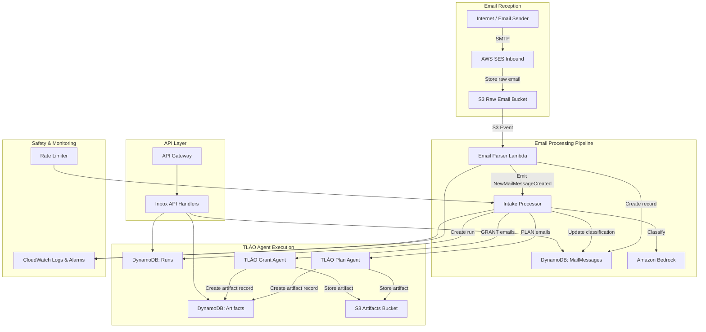

# Design Document: TLÁO Email Handling System

## Overview

The TLÁO Email Handling System extends the existing TLÁO Autonomous Agent Platform by adding email as a first-class intake source. Emails received via AWS SES are stored raw in S3, parsed by a Lambda function into structured MailMessage records in DynamoDB, classified by Amazon Bedrock, and routed to the appropriate TLÁO agent (Plan or Grant) to produce execution artifacts.

The system integrates with the existing backend in `packages/backend/` — reusing the DynamoDB service, S3 service, Bedrock service, rate limiter, and agent orchestrator. New components include the Email Parser Lambda, the Intake Processor service, and new DynamoDB tables for MailMessages, Runs, and Artifacts.

### Key Design Decisions

1. **SES → S3 → Lambda pattern**: SES stores raw emails in S3 first, then triggers Lambda. This decouples reception from processing and ensures no email is lost even if Lambda fails.
2. **Event-driven pipeline**: Each stage emits events (S3 notifications, DynamoDB streams or direct invocations) to the next, enabling retry and observability at each step.
3. **Reuse existing services**: The Bedrock service, DynamoDB wrapper, S3 service, and rate limiter from the existing platform are reused to avoid duplication.
4. **Classification before routing**: Bedrock classifies emails before agent triggering, allowing low-confidence emails to be flagged for human review.
5. **TypeScript throughout**: Consistent with the existing `packages/backend/` codebase using TypeScript, Jest, and fast-check.

## Architecture



### Request Flow

1. External sender sends email to `{mailbox}@xn--tlo-6ma.com` (or custom domain)
2. SES receives the email, validates size (≤5MB), stores raw in S3 at `incoming/{workspaceId}/{messageId}`
3. S3 event triggers Email Parser Lambda
4. Parser extracts: from, subject, body (text + HTML), attachment metadata, threading headers
5. Parser creates MailMessage record in DynamoDB (status: "received"), emits NewMailMessageCreated
6. Intake Processor receives event, checks rate limits
7. Intake Processor sends email body (truncated to 10k chars) to Bedrock for classification
8. Classification result + confidence score written to MailMessage record
9. If confidence ≥ 0.6: create Run record, invoke appropriate agent
10. Agent produces artifact → stored in S3 + Artifacts table
11. MailMessage status updated to "processed", linked to runId

## Components and Interfaces

### 1. Email Parser Lambda

**File**: `packages/backend/src/api/email-parser.ts`

**Responsibility**: Parse raw emails from S3 into structured MailMessage records.

**Interface**:

```typescript
interface EmailParserEvent {
  Records: Array<{
    s3: {
      bucket: { name: string }
      object: { key: string; size: number }
    }
  }>
}

interface ParsedEmail {
  fromAddress: string
  toAddress: string
  subject: string
  bodyText: string
  bodyHtml: string
  receivedAt: number
  inReplyTo?: string
  references?: string[]
  attachments: AttachmentMetadata[]
}

interface AttachmentMetadata {
  filename: string
  contentType: string
  size: number
}
```

**Processing**:

1. Extract workspaceId and messageId from S3 key
2. Download raw email from S3
3. Parse using `mailparser` library (or built-in Node.js `email` parsing)
4. Resolve threadId from In-Reply-To / References headers
5. Look up mailbox → workspace mapping in DynamoDB
6. Create MailMessage record
7. Emit NewMailMessageCreated event (direct Lambda invocation or SNS)

### 2. Intake Processor Service

**File**: `packages/backend/src/services/intake-processor.ts`

**Responsibility**: Classify emails via Bedrock and trigger TLÁO agents.

**Interface**:

```typescript
interface IntakeProcessorConfig {
  workspaceId: string
  messageId: string
}

type EmailClassification =
  | 'client_request'
  | 'bug_report'
  | 'invoice'
  | 'grant_announcement'
  | 'grant_response'
  | 'partner_reply'

interface ClassificationResult {
  classification: EmailClassification
  confidence: number // 0.0 to 1.0
  reasoning: string
}

const PLAN_CLASSIFICATIONS: EmailClassification[] = [
  'client_request',
  'bug_report',
  'invoice',
  'partner_reply',
]

const GRANT_CLASSIFICATIONS: EmailClassification[] = ['grant_announcement', 'grant_response']
```

**Processing**:

1. Retrieve MailMessage from DynamoDB
2. Check rate limits via existing Rate Limiter service
3. Truncate body to 10,000 characters
4. Invoke Bedrock with classification prompt
5. Parse classification result (JSON)
6. Update MailMessage with classification + confidence
7. If confidence ≥ 0.6: determine agent type from classification, create Run, invoke agent
8. If confidence < 0.6: set status to "needs_review"

**Classification Prompt**:

```
You are an email classifier for the TLÁO platform. Classify the following email into exactly one category.

Categories:
- client_request: A client asking for work, deliverables, or services
- bug_report: A report of a software bug or issue
- invoice: A billing document or payment request
- grant_announcement: A new grant opportunity or funding announcement
- grant_response: A response to a previously submitted grant application
- partner_reply: A reply from a business partner continuing an existing workflow

Email:
From: {from}
Subject: {subject}
Body: {body}

Respond with JSON:
{
  "classification": "<category>",
  "confidence": <0.0-1.0>,
  "reasoning": "<brief explanation>"
}
```

### 3. Mailbox Management Service

**File**: `packages/backend/src/services/mailbox-service.ts`

**Responsibility**: CRUD operations for workspace mailboxes.

**Interface**:

```typescript
interface Mailbox {
  workspaceId: string
  mailboxId: string
  name: string
  emailAddress: string
  createdAt: number
  isActive: boolean
}

interface MailboxService {
  createMailbox(
    workspaceId: string,
    name: string,
    tier: 'free' | 'pro',
    customDomain?: string
  ): Promise<Mailbox>
  deleteMailbox(workspaceId: string, mailboxId: string): Promise<void>
  listMailboxes(workspaceId: string): Promise<Mailbox[]>
  resolveMailbox(emailAddress: string): Promise<Mailbox | null>
}
```

### 4. Inbox API Handlers

**File**: `packages/backend/src/api/inbox-handler.ts`

**Responsibility**: REST API endpoints for the email inbox UI.

**Endpoints**:

- `GET /workspaces/{workspaceId}/inbox` — Paginated list of MailMessages
- `GET /workspaces/{workspaceId}/inbox/{messageId}` — Single message with classification, run, artifacts
- `GET /workspaces/{workspaceId}/inbox?status={status}` — Filter by status
- `GET /workspaces/{workspaceId}/inbox?mailbox={mailboxId}` — Filter by mailbox
- `POST /workspaces/{workspaceId}/mailboxes` — Create mailbox
- `DELETE /workspaces/{workspaceId}/mailboxes/{mailboxId}` — Delete mailbox
- `GET /workspaces/{workspaceId}/mailboxes` — List mailboxes

**Response Format** (consistent with existing API patterns):

```typescript
interface InboxListResponse {
  success: boolean
  data: {
    messages: MailMessageSummary[]
    pagination: { total: number; limit: number; offset: number }
  }
  metadata: { requestId: string; timestamp: string }
}
```

### 5. Run and Artifact Services

These extend the existing agent orchestrator pattern. The Run record tracks the execution lifecycle, and the Artifact record stores the output.

**Interface**:

```typescript
interface TlaoRun {
  workspaceId: string
  runId: string
  agentType: 'PLAN' | 'GRANT'
  source: 'EMAIL' | 'UPLOAD' | 'API' | 'CONNECTOR'
  sourceMessageId?: string
  status: 'pending' | 'running' | 'completed' | 'error'
  createdAt: number
  completedAt?: number
  errorMessage?: string
}

interface TlaoArtifact {
  runId: string
  artifactId: string
  type: 'execution_plan' | 'grant_draft' | 'alert'
  s3Key: string
  createdAt: number
}
```

## Data Models

### DynamoDB Tables

#### MailMessages Table

```
Table Name: tlao-mail-messages
Partition Key: workspaceId (String)
Sort Key: messageId (String)

GSI: ReceivedAtIndex
  Partition Key: workspaceId (String)
  Sort Key: receivedAt (Number)

GSI: MailboxIndex
  Partition Key: workspaceId (String)
  Sort Key: mailbox (String)

GSI: StatusIndex
  Partition Key: workspaceId (String)
  Sort Key: status (String)

Attributes:
- workspaceId: String
- messageId: String (UUID)
- mailbox: String (mailbox name)
- fromAddress: String
- toAddress: String
- subject: String
- bodyText: String (truncated to 5000 chars for DynamoDB)
- receivedAt: Number (Unix timestamp)
- s3RawKey: String (S3 path to raw email)
- threadId: String (optional, for threading)
- status: String (received | processing | processed | needs_review | parse_error | processing_error | queued)
- classification: String (optional, email category)
- classificationConfidence: Number (optional, 0.0-1.0)
- linkedRunId: String (optional, reference to TLÁO Run)
- attachments: List<Map> (filename, contentType, size)
- ttl: Number (Unix timestamp for TTL deletion, Free tier only)
```

#### Mailboxes Table

```
Table Name: tlao-mailboxes
Partition Key: workspaceId (String)
Sort Key: mailboxId (String)

GSI: EmailAddressIndex
  Partition Key: emailAddress (String)

Attributes:
- workspaceId: String
- mailboxId: String (UUID)
- name: String
- emailAddress: String
- tier: String (free | pro)
- customDomain: String (optional)
- isActive: Boolean
- createdAt: Number (Unix timestamp)
```

#### Runs Table

```
Table Name: tlao-runs
Partition Key: workspaceId (String)
Sort Key: runId (String)

GSI: SourceIndex
  Partition Key: workspaceId (String)
  Sort Key: createdAt (Number)

Attributes:
- workspaceId: String
- runId: String (UUID)
- agentType: String (PLAN | GRANT)
- source: String (EMAIL | UPLOAD | API | CONNECTOR)
- sourceMessageId: String (optional)
- status: String (pending | running | completed | error)
- createdAt: Number (Unix timestamp)
- completedAt: Number (optional)
- errorMessage: String (optional)
- tokensUsed: Number
```

#### Artifacts Table

```
Table Name: tlao-artifacts
Partition Key: runId (String)
Sort Key: artifactId (String)

Attributes:
- runId: String
- artifactId: String (UUID)
- type: String (execution_plan | grant_draft | alert)
- s3Key: String
- createdAt: Number (Unix timestamp)
- metadata: Map (optional, artifact-specific metadata)
```

### S3 Bucket Structure

```
s3://tlao-email-{accountId}/
├── incoming/
│   └── {workspaceId}/
│       └── {messageId}          # Raw email from SES
├── artifacts/
│   └── {runId}/
│       └── {artifactId}.json    # Agent output artifacts
```

## Cost Analysis and Cost Tracker

### Competitive Benchmark

Target: Beat the competitor Pro tier pricing of $0.82/mo (or $7.60/yr at $0.63/mo).

| Competitor Feature     | Price          |
| ---------------------- | -------------- |
| 1 mailbox              | $0.82/mo       |
| Extra mailbox          | +$0.82/mo each |
| 5 GB per mailbox       | Included       |
| 10 aliases per mailbox | Included       |
| Email & Calendar       | Included       |
| AI email assistant     | Included       |

### AWS Cost Breakdown (Per Workspace, Free Tier Eligible)

| AWS Service                   | Usage Estimate (Free Tier)                 | Monthly Cost                                 |
| ----------------------------- | ------------------------------------------ | -------------------------------------------- |
| **SES Inbound**               | 1,000 emails/mo (first 1,000 free)         | $0.00                                        |
| **SES Inbound** (beyond free) | Per 1,000 emails                           | $0.10                                        |
| **S3 Storage**                | 5 GB (Free Tier: 5 GB for 12 months)       | $0.00 (year 1), ~$0.12/mo after              |
| **S3 Requests**               | ~3,000 PUT/GET per month                   | $0.00 (Free Tier: 2,000 PUT + 20,000 GET)    |
| **Lambda**                    | ~3,000 invocations × 500ms avg             | $0.00 (Free Tier: 1M invocations)            |
| **DynamoDB**                  | ~10,000 WCU + 30,000 RCU/mo                | $0.00 (Free Tier: 25 WCU + 25 RCU on-demand) |
| **DynamoDB Storage**          | ~500 MB per workspace                      | $0.00 (Free Tier: 25 GB)                     |
| **Bedrock (Claude)**          | ~1,000 classifications × ~500 input tokens | ~$1.50/mo (at $0.003/1K input tokens)        |
| **CloudWatch**                | Basic logging                              | $0.00 (Free Tier: 5 GB logs)                 |

### Cost Per Workspace Summary

| Tier                | Emails/mo | Bedrock Calls | Estimated Monthly Cost |
| ------------------- | --------- | ------------- | ---------------------- |
| **Free (light)**    | 100       | 100           | ~$0.15                 |
| **Free (moderate)** | 500       | 500           | ~$0.75                 |
| **Free (heavy)**    | 1,000     | 1,000         | ~$1.50                 |
| **Pro (light)**     | 2,000     | 2,000         | ~$3.00                 |
| **Pro (heavy)**     | 10,000    | 10,000        | ~$15.00                |

### Key Cost Driver: Bedrock Classification

Bedrock is the dominant cost. Each email classification uses ~500 input tokens + ~100 output tokens.

**Cost optimization strategies**:

1. **Cache classifications**: If the same sender+subject pattern repeats, skip Bedrock and reuse the previous classification
2. **Batch classification**: Group emails and classify in batches to reduce per-call overhead
3. **Use cheaper models**: Use Titan for simple classifications, reserve Claude for complex cases
4. **Skip classification for known senders**: If a sender has been classified 10+ times with the same result, auto-classify without Bedrock
5. **Truncate aggressively**: Only send subject + first 500 chars of body for classification (not full 10K)

### Cost Tracker Service

The system needs a `CostTracker` service to monitor per-workspace AWS costs in real-time.

**File**: `packages/backend/src/services/cost-tracker.ts`

**Interface**:

```typescript
interface CostEntry {
  workspaceId: string
  date: string // YYYY-MM-DD
  service: 'ses' | 'bedrock' | 's3' | 'lambda' | 'dynamodb'
  operation: string
  estimatedCostUsd: number
  units: number // emails, tokens, bytes, invocations
}

interface WorkspaceCostSummary {
  workspaceId: string
  period: string // YYYY-MM
  totalEstimatedCostUsd: number
  breakdown: Record<string, number> // service → cost
  emailCount: number
  bedrockTokensUsed: number
  storageBytes: number
}

interface CostTrackerService {
  trackOperation(entry: CostEntry): Promise<void>
  getWorkspaceCost(workspaceId: string, month: string): Promise<WorkspaceCostSummary>
  getWorkspaceDailyCost(workspaceId: string, date: string): Promise<CostEntry[]>
}
```

**DynamoDB Table**: `tlao-cost-tracking`

```
Partition Key: workspaceId (String)
Sort Key: date#service#operation (String)

Attributes:
- workspaceId: String
- dateServiceOp: String (composite sort key)
- estimatedCostUsd: Number
- units: Number
- createdAt: Number
```

**Cost Estimation Rules**:
| Operation | Estimated Cost |
|---|---|
| SES receive (first 1K/mo) | $0.00 |
| SES receive (beyond 1K) | $0.0001/email |
| Bedrock classification | $0.002/call (avg 500 input + 100 output tokens) |
| Bedrock agent execution | $0.01/call (avg 2000 input + 500 output tokens) |
| S3 PUT | $0.000005/request |
| S3 GET | $0.0000004/request |
| S3 storage | $0.023/GB/month |
| DynamoDB write | $0.00000125/WCU |
| DynamoDB read | $0.00000025/RCU |

### Pricing Strategy to Beat $0.82/mo

To offer a competitive price at or below $0.82/mo per workspace:

1. **Free tier**: $0.00/mo — limited to 100 emails/day, 3 mailboxes, 60-day TTL. Our cost: ~$0.15/mo (absorbed)
2. **Pro tier target**: $0.79/mo — 5 mailboxes, custom domain, 5,000 emails/mo, 1-year retention. Our cost: ~$3-5/mo at scale, offset by volume
3. **Cost controls**: Aggressive Bedrock caching, model selection, and truncation keep per-email cost under $0.002

The main lever is Bedrock cost optimization. With classification caching, we can reduce Bedrock calls by 40-60% for workspaces with repetitive email patterns.

## Correctness Properties

_A property is a characteristic or behavior that should hold true across all valid executions of a system — essentially, a formal statement about what the system should do. Properties serve as the bridge between human-readable specifications and machine-verifiable correctness guarantees._

### Property 1: Email parsing round-trip

_For any_ valid structured email (with from, subject, body, attachments), formatting it as a raw RFC 5322 email and then parsing it with the Email Parser should produce an equivalent structured email object with matching fromAddress, subject, bodyText, and attachment metadata.

**Validates: Requirements 2.1**

### Property 2: MailMessage record completeness

_For any_ successfully parsed email, the resulting MailMessage record should contain all required fields (workspaceId, mailbox, messageId, fromAddress, subject, bodyText, receivedAt, s3RawKey, status) and the status should be "received".

**Validates: Requirements 2.2**

### Property 3: Thread assignment from headers

_For any_ email containing an In-Reply-To or References header that matches an existing MailMessage's messageId, the parser should assign the same threadId as the referenced message. For emails without threading headers, a new threadId should be generated.

**Validates: Requirements 2.3**

### Property 4: NewMailMessageCreated event correctness

_For any_ successfully created MailMessage, the emitted NewMailMessageCreated event should contain the correct workspaceId and messageId matching the stored record.

**Validates: Requirements 2.5**

### Property 5: Classification result validity

_For any_ email classified by the Intake Processor, the classification should be one of the six defined categories (client_request, bug_report, invoice, grant_announcement, grant_response, partner_reply) and the confidence score should be a number between 0.0 and 1.0 inclusive.

**Validates: Requirements 3.1, 3.2**

### Property 6: Low-confidence classification routing

_For any_ email with a classification confidence score below 0.6, the MailMessage status should be set to "needs_review" and no TLÁO_Run should be created for that message.

**Validates: Requirements 3.3**

### Property 7: Body truncation for classification

_For any_ email body string, the text sent to Bedrock for classification should have length ≤ 10,000 characters. If the original body length is ≤ 10,000, the text should be unchanged. If the original body length exceeds 10,000, the text should be exactly 10,000 characters.

**Validates: Requirements 3.4**

### Property 8: Classification-to-agent-type mapping

_For any_ email classification, if the classification is in {client_request, bug_report, invoice, partner_reply} then the created TLÁO_Run should have agentType "PLAN". If the classification is in {grant_announcement, grant_response} then the created TLÁO_Run should have agentType "GRANT". All runs created from email should have source "EMAIL".

**Validates: Requirements 4.1, 4.2**

### Property 9: Run completion updates MailMessage

_For any_ TLÁO_Run that completes successfully, the linked MailMessage should have status "processed" and its linkedRunId should match the run's runId.

**Validates: Requirements 4.5**

### Property 10: Artifact creation on run completion

_For any_ completed TLÁO_Run, at least one TLÁO_Artifact should be created with a valid type (execution_plan, grant_draft, or alert), a non-empty s3Key, and a runId matching the completed run.

**Validates: Requirements 4.4**

### Property 11: Mailbox count limit enforcement

_For any_ workspace, creating a mailbox should succeed when the workspace has fewer than 5 active mailboxes and should fail with an error when the workspace already has 5 active mailboxes.

**Validates: Requirements 5.1, 5.2**

### Property 12: Email address generation by tier

_For any_ mailbox name and workspace tier, if the tier is "free" then the generated email address should be `{name}@xn--tlo-6ma.com`. If the tier is "pro" with a custom domain, the generated email address should be `{name}@{customDomain}`.

**Validates: Requirements 5.3, 5.4**

### Property 13: Deleted mailbox rejection

_For any_ deleted mailbox, resolving that mailbox's email address should return null (no active mailbox found), preventing new emails from being accepted for that address.

**Validates: Requirements 5.5**

### Property 14: Mailbox resolution for unknown addresses

_For any_ email address that does not correspond to any active mailbox in any workspace, the mailbox resolution function should return null.

**Validates: Requirements 1.4**

### Property 15: Email size validation

_For any_ email with size greater than 5MB (5,242,880 bytes), the system should reject the email. For emails with size ≤ 5MB, the system should accept the email.

**Validates: Requirements 1.3**

### Property 16: Daily email limit enforcement

_For any_ Free tier workspace, after receiving 100 emails in a calendar day, subsequent emails should be rejected. For workspaces under the limit, emails should be accepted.

**Validates: Requirements 6.1, 6.2**

### Property 17: Free tier TTL calculation

_For any_ MailMessage created in a Free tier workspace at time T, the TTL attribute should be set to T + (60 × 24 × 60 × 60) seconds (60 days from creation).

**Validates: Requirements 6.3**

### Property 18: Processing rate limit enforcement

_For any_ workspace, after 10 email processing operations within a 60-second window, subsequent operations should be queued (MailMessage status set to "queued") rather than processed immediately.

**Validates: Requirements 6.4, 6.5**

### Property 19: Data model serialization round-trip

_For any_ valid MailMessage, TLÁO_Run, or TLÁO_Artifact object, serializing it to DynamoDB format and then deserializing it back should produce an object equivalent to the original.

**Validates: Requirements 7.4, 7.5, 7.6**

### Property 20: Inbox query sort order

_For any_ set of MailMessages in a workspace, querying the inbox should return messages sorted by receivedAt in descending order (newest first).

**Validates: Requirements 8.1**

### Property 21: Inbox query filter correctness

_For any_ inbox query with a status filter or mailbox filter, all returned messages should match the specified filter criteria and no messages matching the criteria should be excluded from the results.

**Validates: Requirements 8.3, 8.4**

### Property 22: S3 key path format

_For any_ incoming email, the S3 storage key should follow the pattern `incoming/{workspaceId}/{messageId}` where workspaceId and messageId are non-empty strings.

**Validates: Requirements 1.1**

### Property 23: Daily volume tracking accuracy

_For any_ workspace, the tracked daily email volume count should equal the actual number of emails received for that workspace on that calendar day.

**Validates: Requirements 10.3**

### Property 24: Usage alarm threshold

_For any_ workspace whose daily email count reaches 80% or more of its daily limit (80 for Free tier), the system should emit an alarm notification.

**Validates: Requirements 10.4**

## Error Handling

### Error Categories and Responses

#### 1. Email Reception Errors

- **Oversized email** (>5MB): SES rejects at reception, logged as rejection event
- **Unknown mailbox**: SES bounces the email, logged with the target address
- **Daily limit exceeded**: Bounce response with message indicating limit reached

#### 2. Parsing Errors

- **Malformed email**: MailMessage created with status "parse_error", raw email retained in S3
- **Missing required headers**: Parser extracts what it can, sets defaults for missing fields
- **Encoding issues**: Parser attempts UTF-8 decoding with fallback to latin-1

#### 3. Classification Errors

- **Bedrock API failure**: Retry with exponential backoff (100ms, 200ms, 400ms), max 3 attempts
- **Invalid classification response**: Log error, set status to "processing_error"
- **Low confidence**: Set status to "needs_review" (not an error, but a routing decision)

#### 4. Agent Execution Errors

- **Agent timeout**: Run status set to "error", partial results stored if available
- **Agent processing failure**: Run status set to "error", MailMessage status set to "processing_error"
- **Artifact storage failure**: Retry S3 put, log error if all retries fail

#### 5. Rate Limit Errors

- **Processing rate exceeded**: MailMessage status set to "queued", processed when rate allows
- **Daily limit exceeded**: Email bounced at reception layer

### Error Response Format

Consistent with existing platform error format:

```json
{
  "error": "Description of the error",
  "code": "ERROR_CODE",
  "details": {
    "workspaceId": "...",
    "messageId": "...",
    "stage": "parsing | classification | agent_execution"
  }
}
```

### Error Codes

| Code                    | HTTP Status | Description                         |
| ----------------------- | ----------- | ----------------------------------- |
| `EMAIL_TOO_LARGE`       | 413         | Email exceeds 5MB limit             |
| `MAILBOX_NOT_FOUND`     | 404         | No active mailbox for the address   |
| `MAILBOX_LIMIT_REACHED` | 400         | Workspace already has 5 mailboxes   |
| `DAILY_LIMIT_EXCEEDED`  | 429         | Free tier daily email limit reached |
| `RATE_LIMIT_EXCEEDED`   | 429         | Processing rate limit exceeded      |
| `PARSE_ERROR`           | 500         | Failed to parse raw email           |
| `CLASSIFICATION_ERROR`  | 500         | Failed to classify email            |
| `AGENT_ERROR`           | 500         | Agent execution failed              |
| `MESSAGE_NOT_FOUND`     | 404         | MailMessage not found               |

## Testing Strategy

### Unit Testing

Unit tests verify specific examples, edge cases, and error conditions:

1. **Email Parser Tests**:
   - Parse a well-formed email with all headers
   - Parse an email with missing optional headers (no In-Reply-To)
   - Parse an email with attachments
   - Handle malformed email gracefully (parse_error status)
   - Handle encoding edge cases (UTF-8, latin-1)

2. **Intake Processor Tests**:
   - Classify a sample client request email
   - Classify a sample grant announcement email
   - Handle low-confidence classification (needs_review)
   - Handle Bedrock API failure with retry
   - Truncate long email bodies correctly

3. **Mailbox Service Tests**:
   - Create mailbox on Free tier (correct address format)
   - Create mailbox on Pro tier with custom domain
   - Reject 6th mailbox creation
   - Delete mailbox and verify inactive
   - Resolve mailbox by email address

4. **Inbox API Tests**:
   - Paginated inbox query
   - Filter by status
   - Filter by mailbox
   - Single message retrieval with linked data

5. **Rate Limiter Tests**:
   - Accept emails under daily limit
   - Reject emails over daily limit
   - Accept processing under rate limit
   - Queue processing over rate limit

### Property-Based Testing

Property-based tests verify universal properties across many generated inputs using `fast-check` (already a dependency in the project).

Each property test runs a minimum of 100 iterations and is tagged with its design property reference.

1. **Property 1: Email parsing round-trip**
   - Generate random email structures, format as raw, parse, verify equivalence
   - Tag: **Feature: tlao-email-system, Property 1: Email parsing round-trip**

2. **Property 5: Classification result validity**
   - Generate random classification results, verify category and confidence bounds
   - Tag: **Feature: tlao-email-system, Property 5: Classification result validity**

3. **Property 7: Body truncation for classification**
   - Generate random strings of varying lengths, verify truncation behavior
   - Tag: **Feature: tlao-email-system, Property 7: Body truncation for classification**

4. **Property 8: Classification-to-agent-type mapping**
   - Generate random classifications, verify correct agent type mapping
   - Tag: **Feature: tlao-email-system, Property 8: Classification-to-agent-type mapping**

5. **Property 11: Mailbox count limit enforcement**
   - Generate workspaces with 0-6 mailboxes, verify creation success/failure
   - Tag: **Feature: tlao-email-system, Property 11: Mailbox count limit enforcement**

6. **Property 12: Email address generation by tier**
   - Generate random mailbox names and tiers, verify address format
   - Tag: **Feature: tlao-email-system, Property 12: Email address generation by tier**

7. **Property 15: Email size validation**
   - Generate random sizes around the 5MB boundary, verify accept/reject
   - Tag: **Feature: tlao-email-system, Property 15: Email size validation**

8. **Property 16: Daily email limit enforcement**
   - Generate workspaces with varying daily counts, verify limit enforcement
   - Tag: **Feature: tlao-email-system, Property 16: Daily email limit enforcement**

9. **Property 17: Free tier TTL calculation**
   - Generate random timestamps, verify TTL is exactly 60 days later
   - Tag: **Feature: tlao-email-system, Property 17: Free tier TTL calculation**

10. **Property 19: Data model serialization round-trip**
    - Generate random MailMessage, Run, and Artifact objects, serialize/deserialize, verify equivalence
    - Tag: **Feature: tlao-email-system, Property 19: Data model serialization round-trip**

11. **Property 20: Inbox query sort order**
    - Generate random sets of messages with varying receivedAt, verify descending sort
    - Tag: **Feature: tlao-email-system, Property 20: Inbox query sort order**

12. **Property 21: Inbox query filter correctness**
    - Generate random messages with varying statuses/mailboxes, apply filters, verify correctness
    - Tag: **Feature: tlao-email-system, Property 21: Inbox query filter correctness**

### Test Configuration

- **Framework**: Jest (existing project setup)
- **Property testing library**: fast-check (already in `packages/backend/node_modules/fast-check`)
- **Minimum iterations**: 100 per property test
- **Coverage target**: 80% for core logic (parser, classifier routing, mailbox service)
- **Tag format**: `Feature: tlao-email-system, Property {N}: {title}`
