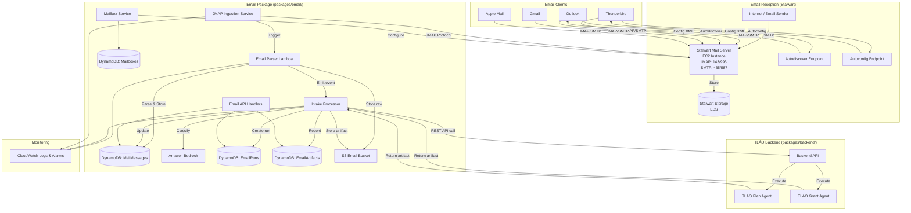

# Design Document: TLÁO Email Handling System

## Overview

The TLÁO Email Handling System is a standalone package within the TLÁO monorepo that provides enterprise-grade email hosting with Stalwart mail server integration and automated operational intelligence extraction. The system is independently deployable with its own API endpoints, database tables, and infrastructure.

Emails are received via Stalwart (supporting IMAP, JMAP, SMTP, etc.), ingested through JMAP protocol, parsed into structured MailMessage records in DynamoDB, classified by Amazon Bedrock, and routed to the appropriate TLÁO agent (Plan or Grant) to produce execution artifacts.

The email package is located at `packages/email/` and communicates with the TLÁO backend (`packages/backend/`) via REST API calls, not direct imports. This decoupling enables independent deployment, scaling, and versioning of the email system.

### Key Design Decisions

1. **Standalone package architecture**: Email system lives in `packages/email/` with its own package.json, dependencies, build process, and deployment pipeline. This enables independent versioning and deployment.
2. **Stalwart mail server substrate**: Uses Stalwart (open-source Rust mail server) for IMAP, JMAP, SMTP, CalDAV, CardDAV, and WebDAV protocols. Provides enterprise-grade mail hosting.
3. **JMAP-first ingestion**: Primary ingestion via JMAP protocol (modern, efficient) with IMAP fallback. Lambda-based parser triggered by JMAP push notifications or polling.
4. **Independent API layer**: Email package exposes its own REST API endpoints (not mixed with backend). Backend can call email API for integration.
5. **Separate database tables**: Email system uses its own DynamoDB tables (MailMessages, Mailboxes, EmailRuns, EmailArtifacts) to avoid coupling with backend schema.
6. **API-based integration**: Email system communicates with TLÁO backend via REST API calls for agent execution, not direct service imports.
7. **Event-driven pipeline**: Each stage emits events (JMAP notifications, DynamoDB streams) to the next, enabling retry and observability.
8. **Classification before routing**: Bedrock classifies emails before agent triggering, allowing low-confidence emails to be flagged for human review.
9. **TypeScript throughout**: Consistent with monorepo standards using TypeScript, Jest, and fast-check.

## Architecture


```mermaid
flowchart TB
    subgraph "Email Clients"
        Thunderbird[Thunderbird]
        Outlook[Outlook]
        Gmail[Gmail]
        AppleMail[Apple Mail]
    end

    subgraph "Email Reception (Stalwart)"
        Internet[Internet / Email Sender]
        Stalwart[Stalwart Mail Server<br/>EC2 Instance<br/>IMAP: 143/993<br/>SMTP: 465/587]
        StalwartDB[(Stalwart Storage<br/>EBS)]
        Autodiscover[Autodiscover Endpoint]
        Autoconfig[Autoconfig Endpoint]
    end

    subgraph "Email Package (packages/email/)"
        JMAPIngestion[JMAP Ingestion Service]
        ParserLambda[Email Parser Lambda]
        MailMessagesTbl[(DynamoDB: MailMessages)]
        IntakeProcessor[Intake Processor]
        Bedrock[Amazon Bedrock]
        EmailAPI[Email API Handlers]
        MailboxService[Mailbox Service]
        MailboxesTbl[(DynamoDB: Mailboxes)]
        EmailRunsTbl[(DynamoDB: EmailRuns)]
        EmailArtifactsTbl[(DynamoDB: EmailArtifacts)]
        S3Email[S3 Email Bucket]
    end

    subgraph "TLÁO Backend (packages/backend/)"
        BackendAPI[Backend API]
        PlanAgent[TLÁO Plan Agent]
        GrantAgent[TLÁO Grant Agent]
    end

    subgraph "Monitoring"
        CloudWatch[CloudWatch Logs & Alarms]
    end

    Internet -->|SMTP| Stalwart
    Thunderbird -->|IMAP/SMTP| Stalwart
    Outlook -->|IMAP/SMTP| Stalwart
    Gmail -->|IMAP/SMTP| Stalwart
    AppleMail -->|IMAP/SMTP| Stalwart
    Outlook -->|Autodiscover| Autodiscover
    Thunderbird -->|Autoconfig| Autoconfig
    Autodiscover -->|Config XML| Outlook
    Autoconfig -->|Config XML| Thunderbird
    Stalwart -->|Store| StalwartDB
    JMAPIngestion -->|JMAP Protocol| Stalwart
    JMAPIngestion -->|Trigger| ParserLambda
    ParserLambda -->|Parse & Store| MailMessagesTbl
    ParserLambda -->|Store raw| S3Email
    ParserLambda -->|Emit event| IntakeProcessor
    IntakeProcessor -->|Classify| Bedrock
    IntakeProcessor -->|Update| MailMessagesTbl
    IntakeProcessor -->|Create run| EmailRunsTbl
    IntakeProcessor -->|REST API call| BackendAPI
    BackendAPI -->|Execute| PlanAgent
    BackendAPI -->|Execute| GrantAgent
    PlanAgent -->|Return artifact| IntakeProcessor
    GrantAgent -->|Return artifact| IntakeProcessor
    IntakeProcessor -->|Store artifact| S3Email
    IntakeProcessor -->|Record| EmailArtifactsTbl

    EmailAPI --> MailMessagesTbl
    EmailAPI --> EmailRunsTbl
    EmailAPI --> EmailArtifactsTbl
    MailboxService --> MailboxesTbl
    MailboxService -->|Configure| Stalwart

    ParserLambda --> CloudWatch
    IntakeProcessor --> CloudWatch
    JMAPIngestion --> CloudWatch
```

### Request Flow

1. External sender sends email to `{mailbox}@{domain}` (configured domain)
2. Stalwart receives email via SMTP, validates, stores in its message store (EBS)
3. JMAP Ingestion Service polls Stalwart via JMAP protocol (or receives push notification)
4. When new email detected, JMAP Ingestion triggers Email Parser Lambda
5. Parser extracts: from, subject, body (text + HTML), attachment metadata, threading headers
6. Parser creates MailMessage record in DynamoDB (status: "received"), stores raw copy in S3
7. Parser emits NewMailMessageCreated event to Intake Processor
8. Intake Processor checks rate limits, sends email body (truncated to 10k chars) to Bedrock for classification
9. Classification result + confidence score written to MailMessage record
10. If confidence ≥ 0.6: create EmailRun record, call Backend API to execute agent
11. Backend API executes appropriate agent (Plan or Grant), returns artifact
12. Intake Processor stores artifact in S3 + EmailArtifacts table
13. MailMessage status updated to "processed", linked to runId

## Components and Interfaces

### Package Structure

```
packages/email/
├── package.json
├── tsconfig.json
├── src/
│   ├── api/
│   │   ├── inbox-handler.ts       # REST API endpoints for inbox
│   │   ├── mailbox-handler.ts     # REST API endpoints for mailbox management
│   │   └── autodiscover-handler.ts # Autodiscover/autoconfig endpoints
│   ├── lambdas/
│   │   └── email-parser.ts        # Lambda function for parsing emails
│   ├── services/
│   │   ├── jmap-ingestion.ts      # JMAP client for Stalwart
│   │   ├── intake-processor.ts    # Classification and routing
│   │   ├── mailbox-service.ts     # Mailbox CRUD operations
│   │   ├── stalwart-client.ts     # Stalwart management API client
│   │   ├── bedrock-client.ts      # Bedrock classification client
│   │   └── cost-tracker.ts        # Cost tracking service
│   ├── types/
│   │   ├── mail-message.ts        # MailMessage type definitions
│   │   ├── mailbox.ts             # Mailbox type definitions
│   │   ├── classification.ts      # Classification type definitions
│   │   └── run.ts                 # EmailRun type definitions
│   ├── lib/
│   │   ├── dynamodb.ts            # DynamoDB wrapper
│   │   ├── s3.ts                  # S3 wrapper
│   │   └── rate-limiter.ts        # Rate limiting logic
│   └── index.ts                   # Package exports
├── tests/
│   ├── unit/
│   └── property/
└── infrastructure/
    └── email-stack.ts             # CDK stack for email infrastructure
```

### 1. JMAP Ingestion Service

**File**: `packages/email/src/services/jmap-ingestion.ts`

**Responsibility**: Monitor Stalwart mailboxes via JMAP protocol and trigger parsing for new emails.

**Interface**:

```typescript
interface JMAPIngestionConfig {
  stalwartUrl: string
  stalwartApiKey: string
  pollIntervalMs: number // Default: 30000 (30 seconds)
}

interface JMAPClient {
  connect(): Promise<void>
  pollForNewEmails(mailboxId: string): Promise<EmailReference[]>
  getEmailContent(emailId: string): Promise<RawEmailContent>
  markAsProcessed(emailId: string): Promise<void>
}

interface EmailReference {
  emailId: string
  mailboxId: string
  receivedAt: number
}
```

**Processing**:

1. Connect to Stalwart via JMAP protocol
2. Poll configured mailboxes for new emails (every 30 seconds)
3. For each new email, trigger Email Parser Lambda
4. Mark email as processed in Stalwart (add flag or move to processed folder)

### 2. Email Parser Lambda

**File**: `packages/email/src/lambdas/email-parser.ts`

**Responsibility**: Parse raw emails from Stalwart into structured MailMessage records.

**Interface**:

```typescript
interface EmailParserEvent {
  emailId: string
  mailboxId: string
  workspaceId: string
}

interface ParsedEmail {
  fromAddress: string
  toAddress: string
  subject: string
  bodyText: string
  bodyHtml: string
  receivedAt: number
  inReplyTo?: string
  references?: string[]
  attachments: AttachmentMetadata[]
}

interface AttachmentMetadata {
  filename: string
  contentType: string
  size: number
}
```

**Processing**:

1. Receive event with emailId, mailboxId, workspaceId
2. Fetch raw email content from Stalwart via JMAP
3. Parse using `mailparser` library
4. Resolve threadId from In-Reply-To / References headers
5. Store raw email copy in S3 at `raw/{workspaceId}/{messageId}`
6. Create MailMessage record in DynamoDB
7. Emit NewMailMessageCreated event to Intake Processor

### 3. Intake Processor Service

**File**: `packages/email/src/services/intake-processor.ts`

**Responsibility**: Classify emails via Bedrock and trigger TLÁO agents via Backend API.

**Interface**:

```typescript
interface IntakeProcessorConfig {
  workspaceId: string
  messageId: string
  backendApiUrl: string // URL to TLÁO backend API
  backendApiKey: string
}

type EmailClassification =
  | 'client_request'
  | 'bug_report'
  | 'invoice'
  | 'grant_announcement'
  | 'grant_response'
  | 'partner_reply'

interface ClassificationResult {
  classification: EmailClassification
  confidence: number // 0.0 to 1.0
  reasoning: string
}

interface AgentExecutionRequest {
  agentType: 'PLAN' | 'GRANT'
  source: 'EMAIL'
  sourceMessageId: string
  emailContent: {
    from: string
    subject: string
    body: string
  }
}

interface AgentExecutionResponse {
  runId: string
  status: 'completed' | 'error'
  artifacts: Array<{
    artifactId: string
    type: string
    content: string
  }>
}

const PLAN_CLASSIFICATIONS: EmailClassification[] = [
  'client_request',
  'bug_report',
  'invoice',
  'partner_reply',
]

const GRANT_CLASSIFICATIONS: EmailClassification[] = ['grant_announcement', 'grant_response']
```

**Processing**:

1. Retrieve MailMessage from DynamoDB
2. Check rate limits via Rate Limiter
3. Truncate body to 10,000 characters
4. Invoke Bedrock with classification prompt
5. Parse classification result (JSON)
6. Update MailMessage with classification + confidence
7. If confidence ≥ 0.6: determine agent type, create EmailRun record
8. Call Backend API to execute agent (POST /api/agents/execute)
9. Receive artifact response from Backend API
10. Store artifact in S3 and EmailArtifacts table
11. Update MailMessage status to "processed"

**Backend API Integration**:

The Intake Processor calls the TLÁO Backend API to execute agents, not direct imports:

```typescript
async function executeAgent(request: AgentExecutionRequest): Promise<AgentExecutionResponse> {
  const response = await fetch(`${backendApiUrl}/api/agents/execute`, {
    method: 'POST',
    headers: {
      'Content-Type': 'application/json',
      'Authorization': `Bearer ${backendApiKey}`,
    },
    body: JSON.stringify(request),
  })
  
  if (!response.ok) {
    throw new Error(`Agent execution failed: ${response.statusText}`)
  }
  
  return response.json()
}
```

### 4. Mailbox Management Service

**File**: `packages/email/src/services/mailbox-service.ts`

**Responsibility**: CRUD operations for workspace mailboxes and Stalwart configuration.

**Interface**:

```typescript
interface Mailbox {
  workspaceId: string
  mailboxId: string
  name: string
  emailAddress: string
  domain: string
  createdAt: number
  isActive: boolean
  ingestionMode: 'operational' | 'opportunity' | 'personal'
}

interface MailboxService {
  createMailbox(
    workspaceId: string,
    name: string,
    domain: string,
    ingestionMode: 'operational' | 'opportunity' | 'personal'
  ): Promise<Mailbox>
  deleteMailbox(workspaceId: string, mailboxId: string): Promise<void>
  listMailboxes(workspaceId: string): Promise<Mailbox[]>
  resolveMailbox(emailAddress: string): Promise<Mailbox | null>
  provisionMailbox(mailbox: Mailbox): Promise<ProvisioningResult>
}

interface ProvisioningResult {
  success: boolean
  credentials?: {
    username: string
    password: string
    imapServer: string
    imapPort: number
    imapSecurity: 'STARTTLS' | 'TLS'
    smtpServer: string
    smtpPort: number
    smtpSecurity: 'STARTTLS' | 'TLS'
  }
  error?: string
}
```

**Stalwart Integration**:

The Mailbox Service calls Stalwart's management API to create principals and configure DNS:

```typescript
async function provisionMailbox(mailbox: Mailbox): Promise<ProvisioningResult> {
  // 1. Create Stalwart principal
  const principal = await stalwartClient.createPrincipal({
    email: mailbox.emailAddress,
    name: mailbox.name,
    password: generateSecurePassword(),
  })
  
  // 2. Configure DNS records (MX, SPF, DKIM, DMARC)
  await configureDNS(mailbox.domain)
  
  // 3. Register mailbox in TLÁO Email system
  await dynamodb.put('tlao-email-mailboxes', mailbox)
  
  // 4. Return credentials with connection details
  return {
    success: true,
    credentials: {
      username: mailbox.emailAddress,
      password: principal.password,
      imapServer: stalwartConfig.hostname,
      imapPort: 993, // IMAPS with TLS
      imapSecurity: 'TLS',
      smtpServer: stalwartConfig.hostname,
      smtpPort: 465, // SMTPS with TLS
      smtpSecurity: 'TLS',
    },
  }
}
```

### 5. Stalwart Client

**File**: `packages/email/src/services/stalwart-client.ts`

**Responsibility**: Interface with Stalwart management API for provisioning and configuration.

**Interface**:

```typescript
interface StalwartClient {
  createPrincipal(params: CreatePrincipalParams): Promise<Principal>
  deletePrincipal(email: string): Promise<void>
  createAlias(alias: string, target: string): Promise<void>
  deleteAlias(alias: string): Promise<void>
  getMailboxInfo(email: string): Promise<MailboxInfo>
}

interface CreatePrincipalParams {
  email: string
  name: string
  password: string
}

interface Principal {
  id: string
  email: string
  name: string
  password: string
  createdAt: number
}

interface MailboxInfo {
  email: string
  quotaUsed: number
  quotaLimit: number
  messageCount: number
}
```

### 6. Inbox API Handlers

**File**: `packages/email/src/api/inbox-handler.ts`

**Responsibility**: REST API endpoints for the email inbox UI.

**Endpoints**:

- `GET /api/email/workspaces/{workspaceId}/inbox` — Paginated list of MailMessages
- `GET /api/email/workspaces/{workspaceId}/inbox/{messageId}` — Single message with classification, run, artifacts
- `GET /api/email/workspaces/{workspaceId}/inbox?status={status}` — Filter by status
- `GET /api/email/workspaces/{workspaceId}/inbox?mailbox={mailboxId}` — Filter by mailbox

**Response Format**:

```typescript
interface InboxListResponse {
  success: boolean
  data: {
    messages: MailMessageSummary[]
    pagination: { total: number; limit: number; offset: number }
  }
  metadata: { requestId: string; timestamp: string }
}
```

### 7. Mailbox API Handlers

**File**: `packages/email/src/api/mailbox-handler.ts`

**Responsibility**: REST API endpoints for mailbox management.

**Endpoints**:

- `POST /api/email/workspaces/{workspaceId}/mailboxes` — Create mailbox
- `DELETE /api/email/workspaces/{workspaceId}/mailboxes/{mailboxId}` — Delete mailbox
- `GET /api/email/workspaces/{workspaceId}/mailboxes` — List mailboxes
- `GET /api/email/workspaces/{workspaceId}/mailboxes/{mailboxId}` — Get mailbox details

### 8. Autodiscover and Autoconfig Endpoints

**File**: `packages/email/src/api/autodiscover-handler.ts`

**Responsibility**: Provide automatic email client configuration for Outlook and Thunderbird.

**Endpoints**:

- `POST /autodiscover/autodiscover.xml` — Microsoft Outlook autodiscover endpoint
- `GET /mail/config-v1.1.xml` — Mozilla Thunderbird autoconfig endpoint
- `GET /.well-known/autoconfig/mail/config-v1.1.xml` — Alternative Thunderbird autoconfig path

**Autodiscover Implementation** (Microsoft Outlook):

```typescript
interface AutodiscoverRequest {
  emailAddress: string
}

interface AutodiscoverResponse {
  protocol: 'IMAP' | 'SMTP'
  server: string
  port: number
  ssl: 'on' | 'off'
  authRequired: boolean
}

async function handleAutodiscover(req: Request): Promise<Response> {
  // Parse Autodiscover XML request
  const emailAddress = parseAutodiscoverXML(req.body)
  
  // Resolve mailbox
  const mailbox = await mailboxService.resolveMailbox(emailAddress)
  if (!mailbox) {
    return new Response('Mailbox not found', { status: 404 })
  }
  
  // Generate Autodiscover XML response
  const xml = `<?xml version="1.0" encoding="utf-8"?>
<Autodiscover xmlns="http://schemas.microsoft.com/exchange/autodiscover/responseschema/2006">
  <Response xmlns="http://schemas.microsoft.com/exchange/autodiscover/outlook/responseschema/2006a">
    <Account>
      <AccountType>email</AccountType>
      <Action>settings</Action>
      <Protocol>
        <Type>IMAP</Type>
        <Server>${stalwartConfig.hostname}</Server>
        <Port>993</Port>
        <SSL>on</SSL>
        <AuthRequired>on</AuthRequired>
        <LoginName>${emailAddress}</LoginName>
      </Protocol>
      <Protocol>
        <Type>SMTP</Type>
        <Server>${stalwartConfig.hostname}</Server>
        <Port>465</Port>
        <SSL>on</SSL>
        <AuthRequired>on</AuthRequired>
        <LoginName>${emailAddress}</LoginName>
      </Protocol>
    </Account>
  </Response>
</Autodiscover>`
  
  return new Response(xml, {
    headers: { 'Content-Type': 'application/xml' },
  })
}
```

**Autoconfig Implementation** (Mozilla Thunderbird):

```typescript
async function handleAutoconfig(req: Request): Promise<Response> {
  // Extract email address from query parameter
  const url = new URL(req.url)
  const emailAddress = url.searchParams.get('emailaddress')
  
  if (!emailAddress) {
    return new Response('Email address required', { status: 400 })
  }
  
  // Resolve mailbox
  const mailbox = await mailboxService.resolveMailbox(emailAddress)
  if (!mailbox) {
    return new Response('Mailbox not found', { status: 404 })
  }
  
  // Generate Autoconfig XML response
  const domain = emailAddress.split('@')[1]
  const xml = `<?xml version="1.0" encoding="UTF-8"?>
<clientConfig version="1.1">
  <emailProvider id="${domain}">
    <domain>${domain}</domain>
    <displayName>TLÁO Email</displayName>
    <displayShortName>TLÁO</displayShortName>
    <incomingServer type="imap">
      <hostname>${stalwartConfig.hostname}</hostname>
      <port>993</port>
      <socketType>SSL</socketType>
      <authentication>password-cleartext</authentication>
      <username>${emailAddress}</username>
    </incomingServer>
    <outgoingServer type="smtp">
      <hostname>${stalwartConfig.hostname}</hostname>
      <port>465</port>
      <socketType>SSL</socketType>
      <authentication>password-cleartext</authentication>
      <username>${emailAddress}</username>
    </outgoingServer>
  </emailProvider>
</clientConfig>`
  
  return new Response(xml, {
    headers: { 'Content-Type': 'application/xml' },
  })
}
```

### 9. Run and Artifact Services

These are specific to the email package and track email-triggered executions.

**Interface**:

```typescript
interface EmailRun {
  workspaceId: string
  runId: string
  agentType: 'PLAN' | 'GRANT'
  source: 'EMAIL'
  sourceMessageId: string
  status: 'pending' | 'running' | 'completed' | 'error'
  createdAt: number
  completedAt?: number
  errorMessage?: string
  backendRunId?: string // Reference to backend's run ID
}

interface EmailArtifact {
  runId: string
  artifactId: string
  type: 'execution_plan' | 'grant_draft' | 'alert'
  s3Key: string
  createdAt: number
}
```

## Stalwart Configuration

### Protocol Support and Port Configuration

Stalwart is configured to support standard email client protocols on the following ports:

**IMAP (Internet Message Access Protocol)**:
- Port 143: IMAP with STARTTLS (upgrade to TLS after connection)
- Port 993: IMAPS with TLS (encrypted from connection start)

**SMTP (Simple Mail Transfer Protocol)**:
- Port 587: SMTP submission with STARTTLS (for sending mail)
- Port 465: SMTPS with TLS (encrypted submission)
- Port 25: SMTP for server-to-server mail transfer (incoming mail from internet)

**Configuration File** (`/etc/stalwart/config.toml`):

```toml
[server.listener."imap"]
bind = ["0.0.0.0:143"]
protocol = "imap"
tls.implicit = false

[server.listener."imaps"]
bind = ["0.0.0.0:993"]
protocol = "imap"
tls.implicit = true

[server.listener."smtp"]
bind = ["0.0.0.0:25"]
protocol = "smtp"
tls.implicit = false

[server.listener."submission"]
bind = ["0.0.0.0:587"]
protocol = "smtp"
tls.implicit = false

[server.listener."submissions"]
bind = ["0.0.0.0:465"]
protocol = "smtp"
tls.implicit = true

[certificate."default"]
cert = "/etc/stalwart/certs/fullchain.pem"
private-key = "/etc/stalwart/certs/privkey.pem"
```

### Security Group Configuration

The EC2 instance running Stalwart requires the following security group rules:

**Inbound Rules**:

| Port | Protocol | Source | Description |
|------|----------|--------|-------------|
| 25 | TCP | 0.0.0.0/0 | SMTP (incoming mail from internet) |
| 143 | TCP | 0.0.0.0/0 | IMAP with STARTTLS |
| 465 | TCP | 0.0.0.0/0 | SMTPS with TLS |
| 587 | TCP | 0.0.0.0/0 | SMTP submission with STARTTLS |
| 993 | TCP | 0.0.0.0/0 | IMAPS with TLS |
| 443 | TCP | VPC CIDR | HTTPS (admin interface, restricted) |
| 8080 | TCP | VPC CIDR | JMAP (internal access only) |

**Outbound Rules**:

| Port | Protocol | Destination | Description |
|------|----------|-------------|-------------|
| All | All | 0.0.0.0/0 | Allow all outbound traffic |

### Email Client Configuration Documentation

**Manual Configuration Guide**:

When provisioning a mailbox, users receive connection details for manual configuration:

**Incoming Mail (IMAP)**:
- Server: `mail.{domain}` or Stalwart hostname
- Port: 993 (recommended) or 143
- Security: SSL/TLS (port 993) or STARTTLS (port 143)
- Username: Full email address (e.g., `user@example.com`)
- Password: Provided during provisioning
- Authentication: Normal password

**Outgoing Mail (SMTP)**:
- Server: `mail.{domain}` or Stalwart hostname
- Port: 465 (recommended) or 587
- Security: SSL/TLS (port 465) or STARTTLS (port 587)
- Username: Full email address (e.g., `user@example.com`)
- Password: Same as incoming mail
- Authentication: Normal password

**Client-Specific Instructions**:

1. **Thunderbird**: Supports autoconfig. Enter email and password, Thunderbird will auto-detect settings via `/mail/config-v1.1.xml`

2. **Outlook**: Supports autodiscover. Enter email and password, Outlook will auto-detect settings via `/autodiscover/autodiscover.xml`

3. **Gmail (web)**: 
   - Go to Settings → Accounts and Import → Check mail from other accounts
   - Add email address, select "Import emails from my other account (POP3)"
   - Note: Gmail only supports POP3 for external accounts, not IMAP
   - Alternative: Use Gmail app with manual IMAP configuration

4. **Apple Mail**:
   - Add Account → Other Mail Account
   - Enter name, email, password
   - Manual configuration: Select IMAP, enter server details
   - Apple Mail will attempt auto-discovery first

5. **iOS Mail**:
   - Settings → Mail → Accounts → Add Account → Other
   - Add Mail Account, enter details
   - Manual configuration if auto-discovery fails

6. **Android (Gmail app)**:
   - Add account → Other
   - Enter email and password
   - Select IMAP account type
   - Enter incoming and outgoing server details

## Data Models

### DynamoDB Tables (Email Package)

All tables are prefixed with `tlao-email-` to namespace them within the email package.

#### MailMessages Table

```
Table Name: tlao-email-messages
Partition Key: workspaceId (String)
Sort Key: messageId (String)

GSI: ReceivedAtIndex
  Partition Key: workspaceId (String)
  Sort Key: receivedAt (Number)

GSI: MailboxIndex
  Partition Key: workspaceId (String)
  Sort Key: mailbox (String)

GSI: StatusIndex
  Partition Key: workspaceId (String)
  Sort Key: status (String)

Attributes:
- workspaceId: String
- messageId: String (UUID)
- mailbox: String (mailbox name)
- fromAddress: String
- toAddress: String
- subject: String
- bodyText: String (truncated to 5000 chars for DynamoDB)
- receivedAt: Number (Unix timestamp)
- s3RawKey: String (S3 path to raw email)
- threadId: String (optional, for threading)
- status: String (received | processing | processed | needs_review | parse_error | processing_error | queued)
- classification: String (optional, email category)
- classificationConfidence: Number (optional, 0.0-1.0)
- linkedRunId: String (optional, reference to EmailRun)
- attachments: List<Map> (filename, contentType, size)
- ingestionMode: String (operational | opportunity | personal)
```

#### Mailboxes Table

```
Table Name: tlao-email-mailboxes
Partition Key: workspaceId (String)
Sort Key: mailboxId (String)

GSI: EmailAddressIndex
  Partition Key: emailAddress (String)

GSI: DomainIndex
  Partition Key: domain (String)

Attributes:
- workspaceId: String
- mailboxId: String (UUID)
- name: String
- emailAddress: String
- domain: String
- ingestionMode: String (operational | opportunity | personal)
- isActive: Boolean
- createdAt: Number (Unix timestamp)
- stalwartPrincipalId: String (reference to Stalwart principal)
```

#### EmailRuns Table

```
Table Name: tlao-email-runs
Partition Key: workspaceId (String)
Sort Key: runId (String)

GSI: SourceIndex
  Partition Key: workspaceId (String)
  Sort Key: createdAt (Number)

GSI: BackendRunIndex
  Partition Key: backendRunId (String)

Attributes:
- workspaceId: String
- runId: String (UUID)
- agentType: String (PLAN | GRANT)
- source: String (EMAIL)
- sourceMessageId: String
- status: String (pending | running | completed | error)
- createdAt: Number (Unix timestamp)
- completedAt: Number (optional)
- errorMessage: String (optional)
- backendRunId: String (optional, reference to backend's run)
- tokensUsed: Number
```

#### EmailArtifacts Table

```
Table Name: tlao-email-artifacts
Partition Key: runId (String)
Sort Key: artifactId (String)

Attributes:
- runId: String
- artifactId: String (UUID)
- type: String (execution_plan | grant_draft | alert)
- s3Key: String
- createdAt: Number (Unix timestamp)
- metadata: Map (optional, artifact-specific metadata)
```

### S3 Bucket Structure (Email Package)

```
s3://tlao-email-{accountId}/
├── raw/
│   └── {workspaceId}/
│       └── {messageId}          # Raw email from Stalwart
├── artifacts/
│   └── {runId}/
│       └── {artifactId}.json    # Agent output artifacts
└── backups/
    └── {date}/
        └── stalwart-backup.tar.gz  # Stalwart data backups
```

### Stalwart Infrastructure

```
EC2 Instance:
- Instance Type: t3.medium (2 vCPU, 4 GB RAM)
- EBS Volume: 100 GB gp3 (encrypted)
- Elastic IP: Assigned for stable reverse DNS
- Security Group: Ports 25 (SMTP), 143 (IMAP), 465 (SMTPS), 587 (submission), 993 (IMAPS), 443 (HTTPS admin), 8080 (JMAP internal)

Route 53:
- MX records for each domain
- SPF, DKIM, DMARC records
- Reverse DNS (PTR) for Elastic IP
- A record: mail.{domain} → Elastic IP
```

## Cost Analysis and Cost Tracker

### Competitive Benchmark

Target: Provide enterprise-grade email with operational intelligence at competitive pricing.

| Competitor Feature     | Price          |
| ---------------------- | -------------- |
| 1 mailbox              | $0.82/mo       |
| Extra mailbox          | +$0.82/mo each |
| 5 GB per mailbox       | Included       |
| 10 aliases per mailbox | Included       |
| Email & Calendar       | Included       |
| AI email assistant     | Included       |

### AWS Cost Breakdown (Per Workspace)

| AWS Service                   | Usage Estimate                             | Monthly Cost                                 |
| ----------------------------- | ------------------------------------------ | -------------------------------------------- |
| **EC2 (Stalwart)**            | t3.medium instance (2 vCPU, 4 GB)          | ~$30.00/mo (shared across workspaces)        |
| **EBS Storage**               | 100 GB gp3 volume                          | ~$8.00/mo (shared across workspaces)         |
| **Elastic IP**                | 1 static IP                                | $0.00 (attached to running instance)         |
| **S3 Storage**                | 5 GB per workspace                         | ~$0.12/mo per workspace                      |
| **S3 Requests**               | ~3,000 PUT/GET per month                   | ~$0.02/mo per workspace                      |
| **Lambda**                    | ~3,000 invocations × 500ms avg             | $0.00 (Free Tier: 1M invocations)            |
| **DynamoDB**                  | ~10,000 WCU + 30,000 RCU/mo                | $0.00 (Free Tier: 25 WCU + 25 RCU on-demand) |
| **DynamoDB Storage**          | ~500 MB per workspace                      | $0.00 (Free Tier: 25 GB)                     |
| **Bedrock (Claude)**          | ~1,000 classifications × ~500 input tokens | ~$1.50/mo per workspace                      |
| **CloudWatch**                | Basic logging                              | $0.00 (Free Tier: 5 GB logs)                 |
| **Route 53**                  | Hosted zone + queries                      | ~$0.50/mo per domain                         |

### Cost Per Workspace Summary

Assuming 100 workspaces sharing the Stalwart infrastructure:

| Tier                | Emails/mo | Bedrock Calls | Estimated Monthly Cost |
| ------------------- | --------- | ------------- | ---------------------- |
| **Shared infra**    | -         | -             | ~$0.38/workspace       |
| **Light usage**     | 100       | 100           | ~$0.15                 |
| **Moderate usage**  | 500       | 500           | ~$0.75                 |
| **Heavy usage**     | 1,000     | 1,000         | ~$1.50                 |
| **Total (light)**   | -         | -             | ~$0.53/workspace       |
| **Total (moderate)**| -         | -             | ~$1.13/workspace       |
| **Total (heavy)**   | -         | -             | ~$1.88/workspace       |

### Key Cost Drivers

1. **Stalwart EC2 instance**: Fixed cost shared across all workspaces. At 100 workspaces, ~$0.38/workspace/mo
2. **Bedrock classification**: Variable cost per email. Dominant cost for high-volume workspaces
3. **S3 storage**: Minimal cost for raw email and artifact storage

**Cost optimization strategies**:

1. **Cache classifications**: If the same sender+subject pattern repeats, skip Bedrock and reuse the previous classification
2. **Batch classification**: Group emails and classify in batches to reduce per-call overhead
3. **Use cheaper models**: Use Titan for simple classifications, reserve Claude for complex cases
4. **Skip classification for known senders**: If a sender has been classified 10+ times with the same result, auto-classify without Bedrock
5. **Truncate aggressively**: Only send subject + first 500 chars of body for classification (not full 10K)
6. **Scale Stalwart vertically**: As workspace count grows, upgrade to larger instance to maintain performance

### Cost Tracker Service

The system needs a `CostTracker` service to monitor per-workspace AWS costs in real-time.

**File**: `packages/email/src/services/cost-tracker.ts`

**Interface**:

```typescript
interface CostEntry {
  workspaceId: string
  date: string // YYYY-MM-DD
  service: 'ec2' | 'bedrock' | 's3' | 'lambda' | 'dynamodb' | 'route53'
  operation: string
  estimatedCostUsd: number
  units: number // emails, tokens, bytes, invocations
}

interface WorkspaceCostSummary {
  workspaceId: string
  period: string // YYYY-MM
  totalEstimatedCostUsd: number
  breakdown: Record<string, number> // service → cost
  emailCount: number
  bedrockTokensUsed: number
  storageBytes: number
}

interface CostTrackerService {
  trackOperation(entry: CostEntry): Promise<void>
  getWorkspaceCost(workspaceId: string, month: string): Promise<WorkspaceCostSummary>
  getWorkspaceDailyCost(workspaceId: string, date: string): Promise<CostEntry[]>
}
```

**DynamoDB Table**: `tlao-email-cost-tracking`

```
Partition Key: workspaceId (String)
Sort Key: date#service#operation (String)

Attributes:
- workspaceId: String
- dateServiceOp: String (composite sort key)
- estimatedCostUsd: Number
- units: Number
- createdAt: Number
```

**Cost Estimation Rules**:
| Operation | Estimated Cost |
|---|---|
| EC2 instance (shared) | $0.38/workspace/mo (at 100 workspaces) |
| Bedrock classification | $0.002/call (avg 500 input + 100 output tokens) |
| Bedrock agent execution | $0.01/call (avg 2000 input + 500 output tokens) |
| S3 PUT | $0.000005/request |
| S3 GET | $0.0000004/request |
| S3 storage | $0.023/GB/month |
| DynamoDB write | $0.00000125/WCU |
| DynamoDB read | $0.00000025/RCU |
| Route 53 hosted zone | $0.50/domain/mo |

### Pricing Strategy

To offer competitive pricing:

1. **Operational tier**: $0.00/mo — Included with TLÁO workspace, limited to operational mailboxes (support@, ops@, alerts@)
2. **Pro tier**: $2.99/mo — Up to 5 mailboxes, custom domain, 5,000 emails/mo, full ingestion modes
3. **Enterprise tier**: Custom — Dedicated Stalwart instance, unlimited mailboxes, SLA

The main lever is Bedrock cost optimization. With classification caching, we can reduce Bedrock calls by 40-60% for workspaces with repetitive email patterns.

## Correctness Properties

_A property is a characteristic or behavior that should hold true across all valid executions of a system — essentially, a formal statement about what the system should do. Properties serve as the bridge between human-readable specifications and machine-verifiable correctness guarantees._

### Property 1: Email parsing round-trip

_For any_ valid structured email (with from, subject, body, attachments), formatting it as a raw RFC 5322 email and then parsing it with the Email Parser should produce an equivalent structured email object with matching fromAddress, subject, bodyText, and attachment metadata.

**Validates: Requirements 17.6**

### Property 2: MailMessage record completeness

_For any_ successfully parsed email, the resulting MailMessage record should contain all required fields (workspaceId, mailbox, messageId, fromAddress, subject, bodyText, receivedAt, s3RawKey, status, ingestionMode) and the status should be "received".

**Validates: Requirements 6.4, 6.5**

### Property 3: Thread assignment from headers

_For any_ email containing an In-Reply-To or References header that matches an existing MailMessage's messageId, the parser should assign the same threadId as the referenced message. For emails without threading headers, a new threadId should be generated.

**Validates: Requirements 6.7**

### Property 4: NewMailMessageCreated event correctness

_For any_ successfully created MailMessage, the emitted NewMailMessageCreated event should contain the correct workspaceId and messageId matching the stored record.

**Validates: Requirements 6.6**

### Property 5: Classification result validity

_For any_ email classified by the Intake Processor, the classification should be one of the six defined categories (client_request, bug_report, invoice, grant_announcement, grant_response, partner_reply) and the confidence score should be a number between 0.0 and 1.0 inclusive.

**Validates: Requirements 7.1, 7.2**

### Property 6: Low-confidence classification routing

_For any_ email with a classification confidence score below 0.6, the MailMessage status should be set to "needs_review" and no EmailRun should be created for that message.

**Validates: Requirements 7.3**

### Property 7: Body truncation for classification

_For any_ email body string, the text sent to Bedrock for classification should have length ≤ 10,000 characters. If the original body length is ≤ 10,000, the text should be unchanged. If the original body length exceeds 10,000, the text should be exactly 10,000 characters.

**Validates: Requirements 6.4**

### Property 8: Classification-to-agent-type mapping

_For any_ email classification, if the classification is in {client_request, bug_report, invoice, partner_reply} then the created EmailRun should have agentType "PLAN". If the classification is in {grant_announcement, grant_response} then the created EmailRun should have agentType "GRANT". All runs created from email should have source "EMAIL".

**Validates: Requirements 7.1, 7.2, 7.4, 8.1, 8.2**

### Property 9: Run completion updates MailMessage

_For any_ EmailRun that completes successfully, the linked MailMessage should have status "processed" and its linkedRunId should match the run's runId.

**Validates: Requirements 7.5**

### Property 10: Artifact creation on run completion

_For any_ completed EmailRun, at least one EmailArtifact should be created with a valid type (execution_plan, grant_draft, or alert), a non-empty s3Key, and a runId matching the completed run.

**Validates: Requirements 7.6, 7.7**

### Property 11: Mailbox ingestion mode assignment

_For any_ mailbox created with a specified ingestion mode (operational, opportunity, personal), the mailbox record should have that ingestion mode, and all MailMessages received at that mailbox should inherit the same ingestion mode.

**Validates: Requirements 4.5, 7.1, 8.1, 9.1**

### Property 12: Stalwart principal creation

_For any_ mailbox provisioning request, if successful, a Stalwart principal should be created with the correct email address, and the mailbox record should store the stalwartPrincipalId.

**Validates: Requirements 4.2, 4.3**

### Property 13: DNS configuration completeness

_For any_ domain provisioned, the system should create MX, SPF, DKIM, and DMARC records, and the Mail_Provisioner should validate DNS propagation before marking provisioning complete.

**Validates: Requirements 3.1, 3.2, 3.3, 3.4, 3.6**

### Property 14: Alias forwarding correctness

_For any_ alias created with one or more target mailboxes, when an email is sent to the alias address, Stalwart should deliver it to all configured target mailboxes.

**Validates: Requirements 14.1, 14.2**

### Property 15: Mailbox resolution for unknown addresses

_For any_ email address that does not correspond to any active mailbox in any workspace, the mailbox resolution function should return null.

**Validates: Requirements 4.1**

### Property 16: JMAP ingestion detection latency

_For any_ new email arriving in a monitored mailbox, the JMAP Ingestion Service should detect it within 60 seconds.

**Validates: Requirements 6.3**

### Property 17: Personal email opt-in enforcement

_For any_ mailbox with personal ingestion mode, if the user has not opted in, the TLÁO_Mail_Ingestion should not access the mailbox contents. If the user has opted in, the system should process emails with privacy controls.

**Validates: Requirements 9.1, 9.2, 9.3**

### Property 18: Outcome linking from content

_For any_ email signal processed, if the email content references existing outcomes, the TLÁO_Mail_Ingestion should create links between the email and those outcomes.

**Validates: Requirements 10.1, 10.2**

### Property 19: Data model serialization round-trip

_For any_ valid MailMessage, EmailRun, or EmailArtifact object, serializing it to DynamoDB format and then deserializing it back should produce an object equivalent to the original.

**Validates: Requirements 17.6**

### Property 20: Inbox query sort order

_For any_ set of MailMessages in a workspace, querying the inbox should return messages sorted by receivedAt in descending order (newest first).

**Validates: Requirements 6.4**

### Property 21: Inbox query filter correctness

_For any_ inbox query with a status filter or mailbox filter, all returned messages should match the specified filter criteria and no messages matching the criteria should be excluded from the results.

**Validates: Requirements 6.4**

### Property 22: S3 key path format

_For any_ raw email stored, the S3 storage key should follow the pattern `raw/{workspaceId}/{messageId}` where workspaceId and messageId are non-empty strings.

**Validates: Requirements 6.4**

### Property 23: Backend API integration correctness

_For any_ EmailRun created with high-confidence classification, the Intake Processor should call the Backend API with the correct agentType, source, and email content, and should receive a valid response with runId and artifacts.

**Validates: Requirements 7.4, 7.5**

### Property 24: Backup integrity verification

_For any_ backup operation to S3, the system should verify backup integrity after upload, and if verification fails, should send a CloudWatch alert.

**Validates: Requirements 11.4, 11.5**

### Property 25: Provisioning result connection details completeness

_For any_ successful mailbox provisioning, the returned ProvisioningResult should contain all required connection details: username, password, imapServer, imapPort (993 or 143), imapSecurity (TLS or STARTTLS), smtpServer, smtpPort (465 or 587), and smtpSecurity (TLS or STARTTLS).

**Validates: Requirements 18.6**

### Property 26: Autodiscover XML format validity

_For any_ valid email address that resolves to an active mailbox, the autodiscover endpoint should return well-formed XML containing IMAP and SMTP protocol configurations with correct server hostname, ports (993 for IMAP, 465 for SMTP), and SSL settings.

**Validates: Requirements 18.7, 18.9**

### Property 27: Autoconfig XML format validity

_For any_ valid email address that resolves to an active mailbox, the autoconfig endpoint should return well-formed XML containing incomingServer (type=imap, port=993, socketType=SSL) and outgoingServer (type=smtp, port=465, socketType=SSL) configurations with correct hostname and authentication settings.

**Validates: Requirements 18.8, 18.10**

### Property 28: IMAP port configuration

_For any_ Stalwart instance, IMAP should be accessible on port 143 with STARTTLS support and port 993 with TLS encryption, and both ports should accept valid username/password authentication.

**Validates: Requirements 18.1, 18.2, 18.5**

### Property 29: SMTP port configuration

_For any_ Stalwart instance, SMTP should be accessible on port 587 with STARTTLS support and port 465 with TLS encryption for authenticated submission, and both ports should accept valid username/password authentication.

**Validates: Requirements 18.3, 18.4, 18.5**

## Error Handling

### Error Categories and Responses

#### 1. Email Reception Errors

- **Stalwart connection failure**: JMAP Ingestion Service retries with exponential backoff, logs error to CloudWatch
- **Unknown mailbox**: Stalwart rejects the email at SMTP level, logged with the target address
- **Mailbox quota exceeded**: Stalwart rejects the email, sends bounce response

#### 2. Parsing Errors

- **Malformed email**: MailMessage created with status "parse_error", raw email retained in S3
- **Missing required headers**: Parser extracts what it can, sets defaults for missing fields
- **Encoding issues**: Parser attempts UTF-8 decoding with fallback to latin-1
- **JMAP fetch failure**: Retry with exponential backoff (100ms, 200ms, 400ms), max 3 attempts

#### 3. Classification Errors

- **Bedrock API failure**: Retry with exponential backoff (100ms, 200ms, 400ms), max 3 attempts
- **Invalid classification response**: Log error, set status to "processing_error"
- **Low confidence**: Set status to "needs_review" (not an error, but a routing decision)

#### 4. Agent Execution Errors

- **Backend API timeout**: Retry once, then set EmailRun status to "error"
- **Backend API failure**: EmailRun status set to "error", MailMessage status set to "processing_error"
- **Artifact storage failure**: Retry S3 put, log error if all retries fail

#### 5. Provisioning Errors

- **Stalwart API failure**: Rollback partial changes, return error to caller
- **DNS configuration failure**: Rollback Stalwart principal, return error with DNS details
- **Domain already exists**: Return error without creating resources

### Error Response Format

Consistent with monorepo error format:

```json
{
  "error": "Description of the error",
  "code": "ERROR_CODE",
  "details": {
    "workspaceId": "...",
    "messageId": "...",
    "stage": "parsing | classification | agent_execution | provisioning"
  }
}
```

### Error Codes

| Code                    | HTTP Status | Description                         |
| ----------------------- | ----------- | ----------------------------------- |
| `MAILBOX_NOT_FOUND`     | 404         | No active mailbox for the address   |
| `MAILBOX_QUOTA_EXCEEDED`| 413         | Mailbox storage quota exceeded      |
| `DOMAIN_ALREADY_EXISTS` | 409         | Domain already configured           |
| `STALWART_API_ERROR`    | 500         | Stalwart management API failure     |
| `DNS_CONFIG_ERROR`      | 500         | DNS configuration failure           |
| `PARSE_ERROR`           | 500         | Failed to parse raw email           |
| `CLASSIFICATION_ERROR`  | 500         | Failed to classify email            |
| `AGENT_ERROR`           | 500         | Agent execution failed              |
| `BACKEND_API_ERROR`     | 500         | Backend API call failed             |
| `MESSAGE_NOT_FOUND`     | 404         | MailMessage not found               |
| `JMAP_CONNECTION_ERROR` | 500         | Failed to connect to Stalwart JMAP  |

## Testing Strategy

### Unit Testing

Unit tests verify specific examples, edge cases, and error conditions:

1. **JMAP Ingestion Tests**:
   - Connect to Stalwart via JMAP
   - Poll for new emails
   - Handle JMAP connection failures
   - Mark emails as processed

2. **Email Parser Tests**:
   - Parse a well-formed email with all headers
   - Parse an email with missing optional headers (no In-Reply-To)
   - Parse an email with attachments
   - Handle malformed email gracefully (parse_error status)
   - Handle encoding edge cases (UTF-8, latin-1)

3. **Intake Processor Tests**:
   - Classify a sample client request email
   - Classify a sample grant announcement email
   - Handle low-confidence classification (needs_review)
   - Handle Bedrock API failure with retry
   - Truncate long email bodies correctly
   - Call Backend API with correct parameters
   - Handle Backend API failures

4. **Mailbox Service Tests**:
   - Create mailbox with operational ingestion mode
   - Create mailbox with custom domain
   - Delete mailbox and verify inactive
   - Resolve mailbox by email address
   - Provision mailbox in Stalwart
   - Handle Stalwart API failures

5. **Stalwart Client Tests**:
   - Create principal via management API
   - Delete principal
   - Create alias
   - Handle API authentication failures

6. **Inbox API Tests**:
   - Paginated inbox query
   - Filter by status
   - Filter by mailbox
   - Single message retrieval with linked data

7. **DNS Configuration Tests**:
   - Create MX record
   - Create SPF, DKIM, DMARC records
   - Validate DNS propagation
   - Handle Route 53 failures

8. **Autodiscover and Autoconfig Tests**:
   - Generate autodiscover XML for valid mailbox
   - Generate autoconfig XML for valid mailbox
   - Handle unknown email addresses (404 response)
   - Validate XML format and required fields
   - Test alternative autoconfig path (/.well-known/autoconfig/mail/config-v1.1.xml)

9. **Email Client Connection Tests**:
   - Verify IMAP connection on port 143 with STARTTLS
   - Verify IMAPS connection on port 993 with TLS
   - Verify SMTP connection on port 587 with STARTTLS
   - Verify SMTPS connection on port 465 with TLS
   - Test authentication with valid credentials
   - Test authentication failure with invalid credentials
   - Verify IMAP IDLE support for push notifications

### Property-Based Testing

Property-based tests verify universal properties across many generated inputs using `fast-check`.

Each property test runs a minimum of 100 iterations and is tagged with its design property reference.

1. **Property 1: Email parsing round-trip**
   - Generate random email structures, format as raw, parse, verify equivalence
   - Tag: **Feature: tlao-email-system, Property 1: Email parsing round-trip**

2. **Property 5: Classification result validity**
   - Generate random classification results, verify category and confidence bounds
   - Tag: **Feature: tlao-email-system, Property 5: Classification result validity**

3. **Property 7: Body truncation for classification**
   - Generate random strings of varying lengths, verify truncation behavior
   - Tag: **Feature: tlao-email-system, Property 7: Body truncation for classification**

4. **Property 8: Classification-to-agent-type mapping**
   - Generate random classifications, verify correct agent type mapping
   - Tag: **Feature: tlao-email-system, Property 8: Classification-to-agent-type mapping**

5. **Property 11: Mailbox ingestion mode assignment**
   - Generate mailboxes with varying ingestion modes, verify inheritance to messages
   - Tag: **Feature: tlao-email-system, Property 11: Mailbox ingestion mode assignment**

6. **Property 13: DNS configuration completeness**
   - Generate random domains, verify all required DNS records created
   - Tag: **Feature: tlao-email-system, Property 13: DNS configuration completeness**

7. **Property 14: Alias forwarding correctness**
   - Generate random aliases with multiple targets, verify delivery to all
   - Tag: **Feature: tlao-email-system, Property 14: Alias forwarding correctness**

8. **Property 19: Data model serialization round-trip**
   - Generate random MailMessage, EmailRun, and EmailArtifact objects, serialize/deserialize, verify equivalence
   - Tag: **Feature: tlao-email-system, Property 19: Data model serialization round-trip**

9. **Property 20: Inbox query sort order**
   - Generate random sets of messages with varying receivedAt, verify descending sort
   - Tag: **Feature: tlao-email-system, Property 20: Inbox query sort order**

10. **Property 21: Inbox query filter correctness**
    - Generate random messages with varying statuses/mailboxes, apply filters, verify correctness
    - Tag: **Feature: tlao-email-system, Property 21: Inbox query filter correctness**

11. **Property 23: Backend API integration correctness**
    - Generate random email runs, call Backend API, verify response structure
    - Tag: **Feature: tlao-email-system, Property 23: Backend API integration correctness**

12. **Property 25: Provisioning result connection details completeness**
    - Generate random mailbox provisioning requests, verify all connection details present
    - Tag: **Feature: tlao-email-system, Property 25: Provisioning result connection details completeness**

13. **Property 26: Autodiscover XML format validity**
    - Generate random email addresses with valid mailboxes, verify autodiscover XML structure
    - Tag: **Feature: tlao-email-system, Property 26: Autodiscover XML format validity**

14. **Property 27: Autoconfig XML format validity**
    - Generate random email addresses with valid mailboxes, verify autoconfig XML structure
    - Tag: **Feature: tlao-email-system, Property 27: Autoconfig XML format validity**

### Integration Testing

Integration tests verify the email package works correctly with external systems:

1. **Stalwart Integration**:
   - End-to-end test: Send email to Stalwart, verify JMAP ingestion, parsing, classification
   - Test mailbox provisioning flow
   - Test alias creation and forwarding

2. **Backend API Integration**:
   - Mock Backend API, verify Intake Processor calls with correct parameters
   - Test artifact storage after agent execution

3. **AWS Services Integration**:
   - Test DynamoDB operations (create, query, update)
   - Test S3 operations (put, get)
   - Test Route 53 DNS record creation

4. **Email Client Integration**:
   - End-to-end test: Configure Thunderbird with autoconfig, send/receive email
   - End-to-end test: Configure Outlook with autodiscover, send/receive email
   - Test IMAP operations (FETCH, STORE, SEARCH, IDLE) from standard clients
   - Test SMTP submission from standard clients
   - Verify TLS certificate validation on secure ports

### Test Configuration

- **Framework**: Jest (monorepo standard)
- **Property testing library**: fast-check
- **Minimum iterations**: 100 per property test
- **Coverage target**: 80% for core logic (parser, classifier routing, mailbox service, Stalwart client)
- **Tag format**: `Feature: tlao-email-system, Property {N}: {title}`

### Deployment Testing

Before deploying to production:

1. **Smoke tests**: Verify all API endpoints respond
2. **Stalwart health check**: Verify Stalwart is running and accepting connections
3. **JMAP connectivity**: Verify JMAP Ingestion can connect to Stalwart
4. **DNS validation**: Verify all DNS records are correctly configured
5. **Backend API connectivity**: Verify email package can reach Backend API

## Package Configuration

### package.json

The email package has its own `package.json` with independent versioning and dependencies:

```json
{
  "name": "@tlao/email",
  "version": "1.0.0",
  "description": "TLÁO Email System - Standalone email package with Stalwart integration",
  "main": "dist/index.js",
  "types": "dist/index.d.ts",
  "scripts": {
    "build": "tsc",
    "dev": "tsc --watch",
    "test": "jest",
    "test:watch": "jest --watch",
    "test:coverage": "jest --coverage",
    "lint": "eslint src/**/*.ts",
    "type-check": "tsc --noEmit",
    "deploy": "cdk deploy EmailStack",
    "deploy:lambda": "npm run build && aws lambda update-function-code --function-name email-parser"
  },
  "dependencies": {
    "aws-sdk": "^2.1000.0",
    "mailparser": "^3.6.0",
    "uuid": "^9.0.0",
    "node-fetch": "^3.3.0"
  },
  "devDependencies": {
    "@types/node": "^20.0.0",
    "@types/uuid": "^9.0.0",
    "typescript": "^5.0.0",
    "jest": "^29.0.0",
    "fast-check": "^3.0.0",
    "eslint": "^8.0.0",
    "aws-cdk-lib": "^2.0.0"
  }
}
```

### Deployment Architecture

The email package is deployed independently from the backend:

1. **Lambda Functions**: Email Parser Lambda deployed via AWS CDK
2. **API Gateway**: Separate API Gateway for email endpoints (`/api/email/*`)
3. **DynamoDB Tables**: Email-specific tables created via CDK
4. **S3 Bucket**: Email-specific bucket for raw emails and artifacts
5. **EC2 Instance**: Stalwart mail server on dedicated EC2 instance
6. **Environment Variables**:
   - `STALWART_URL`: URL to Stalwart JMAP endpoint
   - `STALWART_API_KEY`: API key for Stalwart management
   - `STALWART_HOSTNAME`: Public hostname for email client connections (e.g., mail.example.com)
   - `BACKEND_API_URL`: URL to TLÁO backend API
   - `BACKEND_API_KEY`: API key for backend authentication
   - `BEDROCK_REGION`: AWS region for Bedrock
   - `EMAIL_BUCKET`: S3 bucket name for email storage

### Integration with Backend

The email package integrates with the backend via REST API:

**Backend API Endpoint** (to be implemented in `packages/backend/`):

```
POST /api/agents/execute
Authorization: Bearer {apiKey}
Content-Type: application/json

{
  "agentType": "PLAN" | "GRANT",
  "source": "EMAIL",
  "sourceMessageId": "uuid",
  "emailContent": {
    "from": "sender@example.com",
    "subject": "Email subject",
    "body": "Email body text"
  }
}

Response:
{
  "runId": "uuid",
  "status": "completed" | "error",
  "artifacts": [
    {
      "artifactId": "uuid",
      "type": "execution_plan" | "grant_draft",
      "content": "artifact content"
    }
  ]
}
```

The backend package does NOT import email package code directly. All communication is via HTTP API calls.
