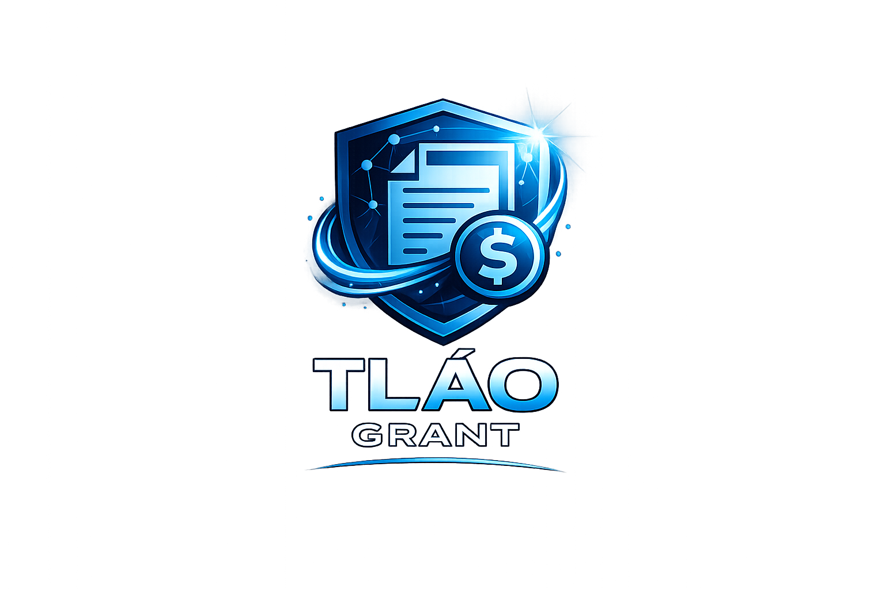
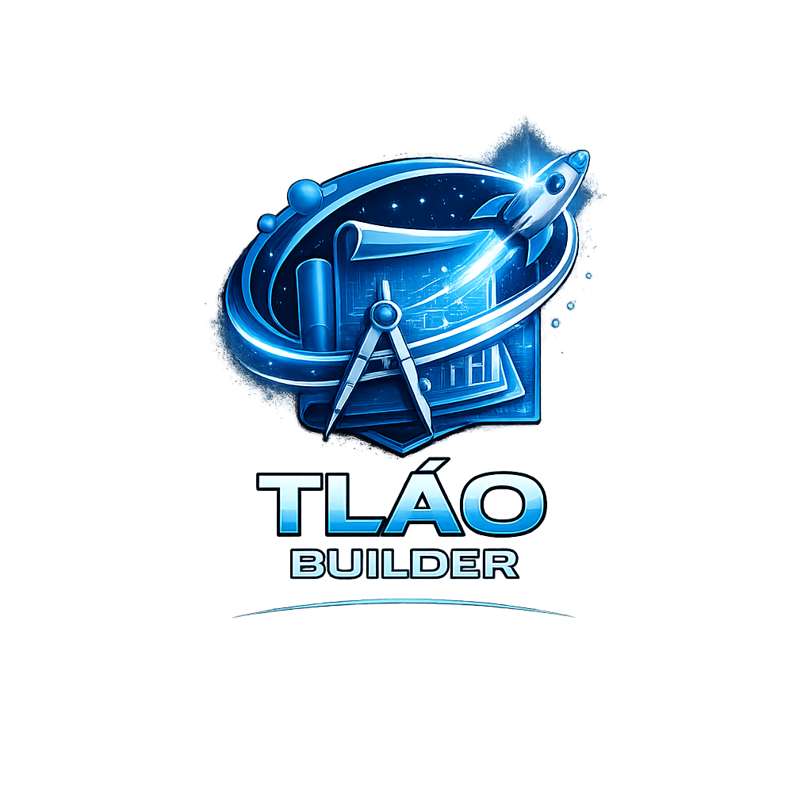

<div align="center">
  

<br/><br/>

  
  
  
  
</div>

# TLÁO - Autonomous Agent Platform


[](https://github.com/lstech-solutions/aws-tlao/actions/workflows/ci.yml)
[](https://github.com/lstech-solutions/aws-tlao/actions/workflows/deploy-github-pages.yml)
[](https://lstech-solutions.github.io/aws-tlao/)
[](https://github.com/lstech-solutions/aws-tlao)

> **TLÁO** — inspired by the Ancient Greek verb τλάω (tláō), meaning "to bear" or "to endure", and by Ἄτλας (Atlas) — "the bearer".

**TLÁO** stands for **Tactical Layer for Action & Outcomes**, inspired by the Greek concept of bearing and enduring work on behalf of others. TLÁO represents a platform designed to carry the operational and administrative burden so people can focus on execution and impact.

An autonomous agent platform with four specialized AI agents:

| Agent            | Description                                                            |
| ---------------- | ---------------------------------------------------------------------- |
| **TLÁO Plan**    | Transforms operational inputs into structured weekly execution plans   |
| **TLÁO Grant**   | Matches organizations to funding opportunities and generates proposals |
| **TLÁO Builder** | Creates and configures custom AI agents for specific workflows         |
| **TLÁO Email**   | Automates email triage, responses, and follow-up tracking              |

## 🎯 The Problem

Solo founders and small organizations waste massive time context-switching between:

- Email inboxes
- Scattered notes and documents
- GitHub issues and PRs
- Invoices and financial records
- Meeting notes and action items
- Grant research and application materials

This gives them **"AI middle management"** — automating the operational overhead so they can focus on building.

## 💡 The Solution

**TLÁO** ingests all your messy operational data and delivers:

- **TLÁO Plan**: Weekly Execution Plans with prioritized, actionable tasks with deadlines
- **TLÁO Grant**: Grant matching and proposal generation for organizations
- **TLÁO Builder**: Custom agent creation for domain-specific automation
- **TLÁO Email**: Intelligent email automation with context-aware responses
- **Real-time Alerts**: Critical issues that need immediate attention
- **Metrics Dashboard**: KPIs, burn rate, progress tracking
- **Context Synthesis**: AI connects dots across all your data sources
- **Smart Reminders**: Deadline tracking and follow-up automation

## 🏗️ Technical Architecture

### AWS Services (Free Tier)

- **Amazon Bedrock**: Claude/Titan for intelligent reasoning and planning
- **AWS Lambda**: Serverless compute for real-time processing
- **Amazon DynamoDB**: High-performance data storage
- **Amazon S3**: Document and data storage
- **Amazon SES**: Email ingestion and notifications
- **Amazon EventBridge**: Event-driven workflows
- **Amazon Transcribe**: Audio transcription for voice inputs

### Technology Stack

- **Frontend**: Next.js 15 with React 19, TypeScript, Tailwind CSS
- **Backend**: Node.js with TypeScript, AWS SDK
- **Deployment**: GitHub Pages (landing page), AWS Lambda (backend)
- **Development**: Turbo monorepo, pnpm package manager
- **Versioning**: [@edcalderon/versioning](https://www.npmjs.com/package/@edcalderon/versioning) for monorepo release management

## 🚀 Getting Started

### Prerequisites

- Node.js 22.22.0
- pnpm 8.0+
- AWS Account with Free Tier access
- Git

### Installation

```bash
# Clone the repository
git clone https://github.com/lstech-solutions/aws-tlao.git
cd aws-tlao

# Install dependencies
pnpm install

# Set up environment variables
cp .env.example .env.local
```

### Development

```bash
# Start development servers
pnpm run dev

# Run type checking
pnpm run type-check

# Run linting
pnpm run lint

# Build for production
pnpm run build
```

### Release

```bash
# Full monorepo patch release (bump + lint + build + changelog + push)
pnpm run release:patch

# Release individual apps
pnpm run release:landing:patch
pnpm run release:docs:patch

# Backend releases independently
pnpm run release:backend
```

## 📦 Project Structure

```
aws-tlao/
├── apps/
│   ├── landing/              # Next.js landing page
│   │   ├── src/
│   │   │   ├── app/          # App routes and pages
│   │   │   ├── components/   # React components (3D carousel, Hero, etc.)
│   │   │   └── lib/          # Utilities
│   │   └── public/           # Static assets (logos, favicons)
│   └── docs/                 # Docusaurus documentation site
├── packages/
│   └── backend/              # AWS Lambda functions (independent versioning)
│       ├── src/
│       │   ├── api/          # API endpoints
│       │   ├── agents/       # TLÁO Plan and TLÁO Grant agents
│       │   ├── services/     # AWS service integrations
│       │   └── models/       # Data models
│       └── tests/            # Test files
└── .github/workflows/        # CI/CD workflows
```

## 🎨 Core Agents

### TLÁO Plan

- Weekly intelligent prioritization of tasks from emails, notes, transcripts
- Automatic deadline extraction and reminders
- AI-suggested task owners and dependency mapping
- Critical issue alerts

### TLÁO Grant

- AI-powered matching of organizations to relevant grants
- Automated eligibility scoring
- First-pass proposal drafts
- Multilingual support (English, Spanish, Portuguese)

### TLÁO Builder

- Custom agent creation for domain-specific workflows
- Template-based agent configuration
- Integration with existing TLÁO agents

### TLÁO Email

- Intelligent email triage and categorization
- Context-aware automated responses
- Follow-up tracking and reminders
- Integration with TLÁO Plan for task extraction

## 📊 How It Works

```
Messy Inputs
    ↓
[Email, Notes, Invoices, GitHub Issues, Documents, Audio]
    ↓
Amazon SES / S3 Ingestion
    ↓
Document Processing & Parsing
    ↓
Amazon Transcribe (for audio)
    ↓
Amazon Bedrock (Claude)
    ↓
TLÁO Plan / TLÁO Grant / TLÁO Builder / TLÁO Email
    ↓
DynamoDB Storage
    ↓
Plans + Alerts + Metrics + Proposals + Responses
    ↓
Dashboard + Email Notifications
```

## 🔐 Security & Privacy

- End-to-end encryption for sensitive data
- GDPR-compliant data handling
- Secure API authentication with Builder ID
- Privacy Policy: [privacy@lstech.solutions](mailto:privacy@lstech.solutions)
- Legal Inquiries: [legal@lstech.solutions](mailto:legal@lstech.solutions)

## 📞 Support & Contact

- **General Inquiries**: [contact@lstech.solutions](mailto:contact@lstech.solutions)
- **Security Issues**: [security@lstech.solutions](mailto:security@lstech.solutions)
- **Website**: [https://tlao.dev](https://tlao.dev)

## 📊 Version History

See [CHANGELOG.md](./CHANGELOG.md) for detailed version history.

Current Version: **1.3.7**

## 📚 Documentation

- [VERSIONING.md](./VERSIONING.md) - Version management guide
- [DEPLOYMENT.md](./DEPLOYMENT.md) - Deployment instructions
- [CHANGELOG.md](./CHANGELOG.md) - Release notes
- [ROADMAP.md](./ROADMAP.md) - Development roadmap

## 🏆 AWS 10,000 AIdeas Challenge

This project is an official submission to the AWS 10,000 AIdeas Challenge.

- ✅ Uses Kiro for application development
- ✅ Built within AWS Free Tier limits
- ✅ Original application (not previously published)
- ✅ Comprehensive AWS service documentation
- ✅ Clear market impact and scalability

---

**Team**: LSTS
**Contact**: admin@lealsystem.net
**Last Updated**: February 2026
